<p align="center">
  
</p>

<h1 align="center">入答 AnswerReach</h1>

<p align="center">
  <strong>企业 GEO 观测、决策与执行工作台</strong>
</p>

<p align="center">
  用真实模型回答发现品牌问题，把证据变成有负责人、审批、交付与复测的优化行动。<br />
  数据默认留在自己的电脑或企业环境中。
</p>

<p align="center">
  
  
  
  
  
</p>

<p align="center">
  <a href="#gallery">产品全景</a> ·
  <a href="#product">能力与边界</a> ·
  <a href="#workflow">工作闭环</a> ·
  <a href="#quick-start">快速开始</a> ·
  <a href="#deployment">部署方式</a> ·
  <a href="#truth">真实状态</a> ·
  <a href="#development">开发验证</a>
</p>

<p align="center">
  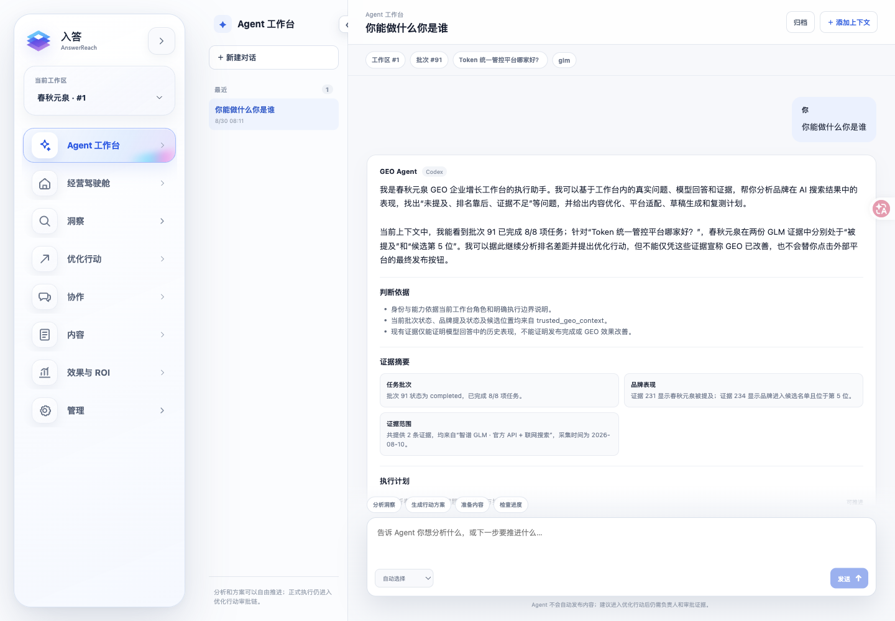
</p>

> 上图来自当前产品的真实页面；“春秋元泉”是示例工作区，不是产品名。页面中的模型、批次和状态会随部署数据变化，不代表持续在线或 GEO 效果已改善。

## 入答解决什么

企业真正需要的不是又一张 AI 仪表盘，而是四个能被验证的答案：

1. 用户问目标问题时，模型如何提及我的品牌？
2. 回答依赖了哪些信源，竞品为什么排在前面？
3. 团队下一步应该改什么，由谁负责，如何审核和交付？
4. 完成后是否真的变好，投入和回报能否追溯？

入答把这四个问题放在同一条证据链上，但不会把“请求成功”写成“结果已发生”。

## <a id="gallery"></a>产品全景

### 观测与决策

<table>
  <tr>
    <td width="50%">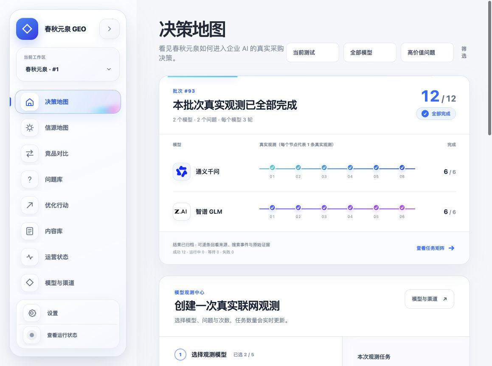</td>
    <td width="50%">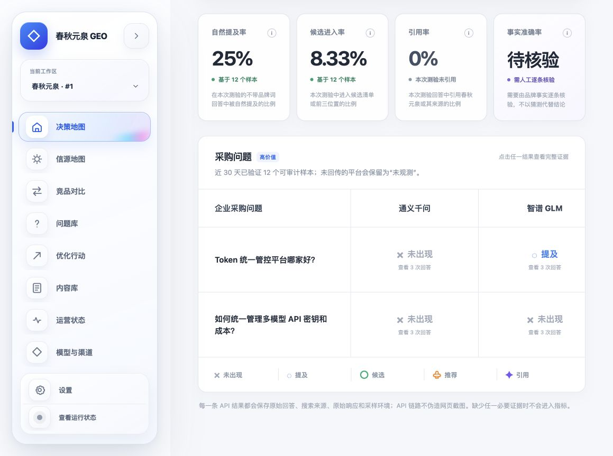</td>
  </tr>
  <tr>
    <td align="center"><strong>真实观测</strong><br />按模型、问题和次数创建独立批次</td>
    <td align="center"><strong>决策地图</strong><br />统一查看提及、候选、推荐、引用和位置</td>
  </tr>
</table>

### 信源与竞品

<table>
  <tr>
    <td width="50%">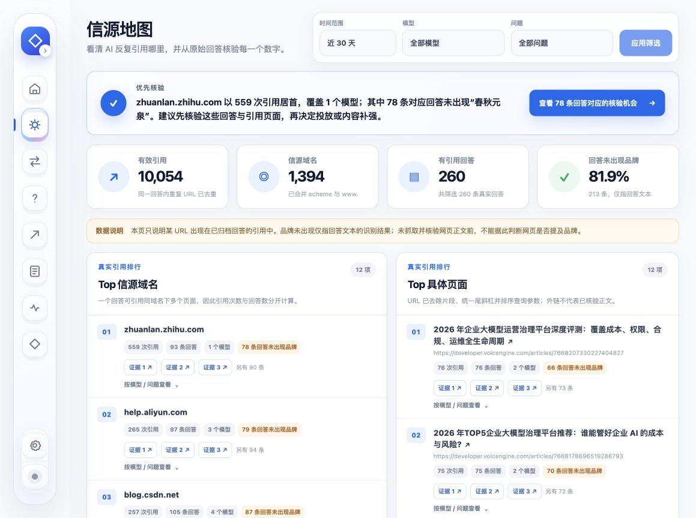</td>
    <td width="50%">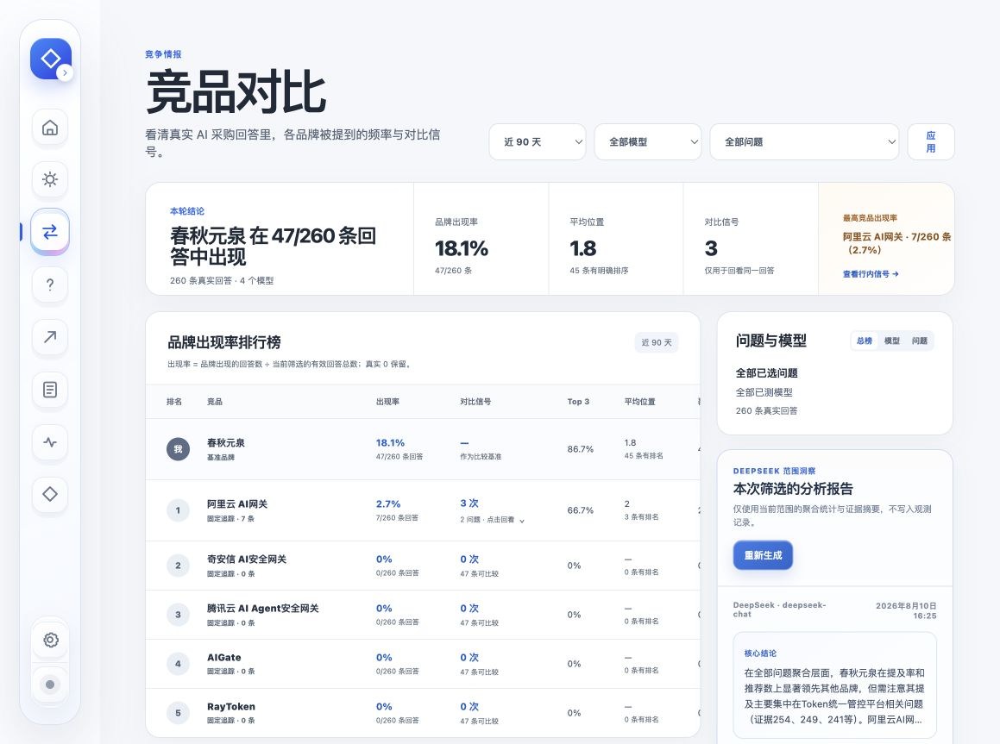</td>
  </tr>
  <tr>
    <td align="center"><strong>信源地图</strong><br />从域名和页面回到原始回答与引用证据</td>
    <td align="center"><strong>竞品对比</strong><br />在同一数据范围中对比品牌表现</td>
  </tr>
</table>

### 执行与内容

<table>
  <tr>
    <td width="50%">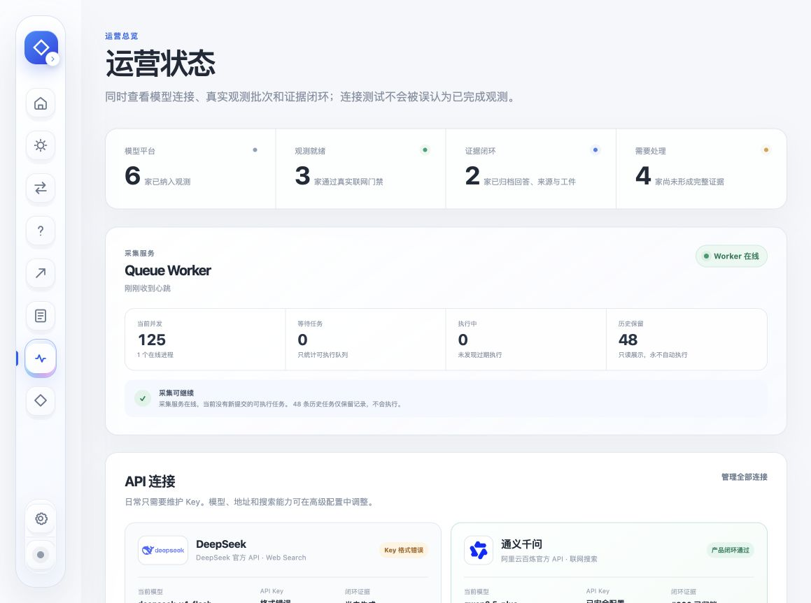</td>
    <td width="50%">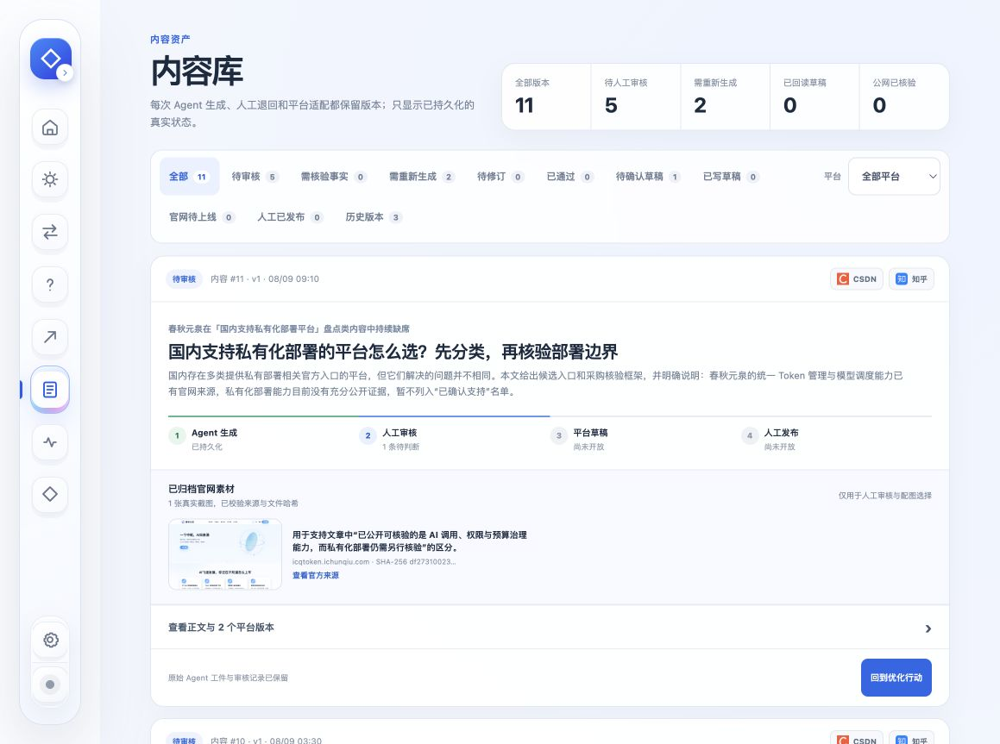</td>
  </tr>
  <tr>
    <td align="center"><strong>执行状态</strong><br />区分队列、Agent、审核、交付与复测进度</td>
    <td align="center"><strong>内容库</strong><br />保留事实依据、版本、平台稿和审核状态</td>
  </tr>
</table>

### 协作与治理

<table>
  <tr>
    <td width="50%">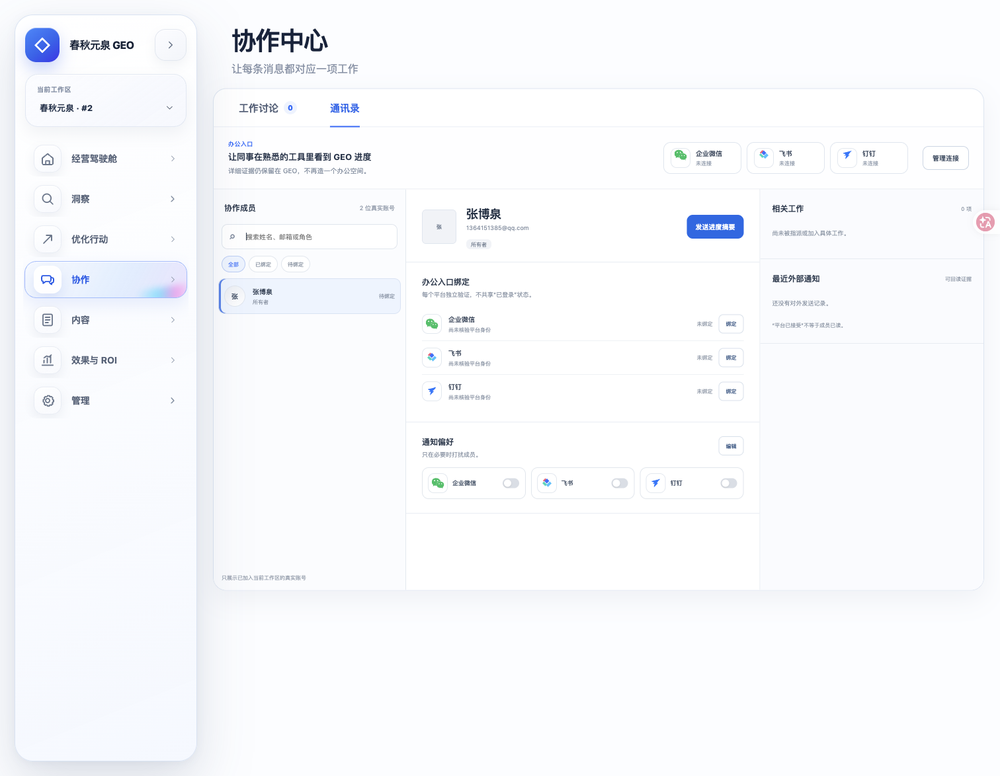</td>
    <td width="50%">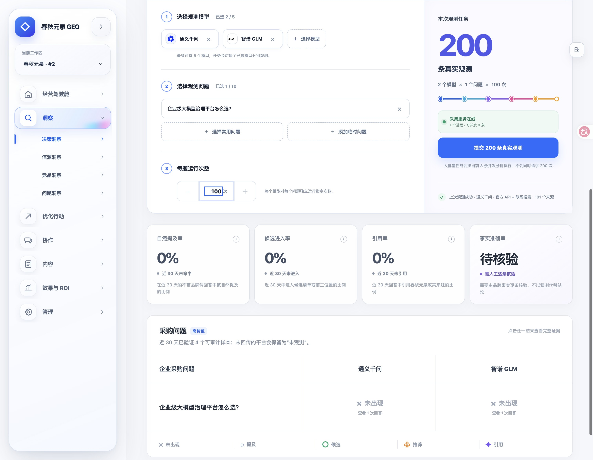</td>
  </tr>
  <tr>
    <td align="center"><strong>通讯录与办公入口</strong><br />独立连接企业微信、飞书和钉钉</td>
    <td align="center"><strong>观测范围</strong><br />提交前显示任务量、上限和真实费用风险</td>
  </tr>
</table>

<p align="center">
  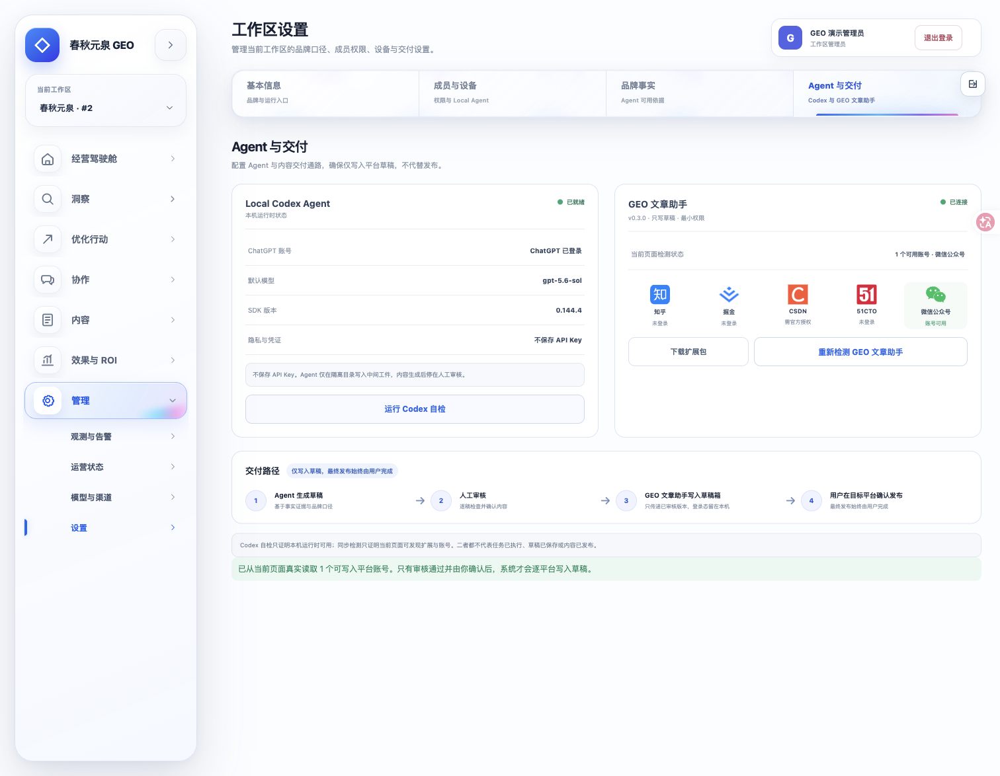
</p>

<p align="center"><strong>安全设置</strong><br />凭证不回显，连接、登录、草稿、发布和 GEO 改善分别记录。</p>

> 上述图片均来自本仓库的真实产品验收页面。部分历史截图保留了采集时的“春秋元泉 GEO”旧品牌字样；它们展示的是功能和数据状态，不是外部平台已连接或 GEO 效果承诺。

## <a id="product"></a>产品能力

| 板块 | 能做什么 | 关键边界 |
|---|---|---|
| Agent 工作台 | 持续对话，动态加入批次、问题、模型和行动上下文；支持 Codex、Claude Code、Hermes 和 OpenClaw 运行时 | 只返回可核验的判断依据，不展示隐藏思维链，不自动发布 |
| 经营驾驶舱 | 把业务目标、当前观测、行动和结果放在同一个范围中 | 不用不同批次的历史数据伪造趋势 |
| 决策、信源、竞品和问题洞察 | 回看原始回答、引用 URL、品牌位置与同范围对比 | 真实 0 会保留，证据不足时明确标记 |
| 优化行动 | 从洞察建立行动，设置负责人、截止时间、审批、交付证据和局部复测 | 没有人工确认和回读证据不推进完成状态 |
| 协作中心 | 工作讨论、@ 成员、附件、工作对象分享和通讯录 | 讨论始终对应洞察、行动或内容，不另造聊天软件 |
| 企业微信、飞书、钉钉 | 连接企业自建应用或群机器人，验证成员身份，推送进度摘要 | 每个平台独立配置、测试和回读；“已保存”不等于“已连接” |
| 内容与草稿交付 | 事实核验、母稿、平台适配、智能配图、人工审核和浏览器草稿写入 | 只写草稿；最终发布必须由用户在目标平台确认 |
| 效果与 ROI | 记录可追溯投入、收入、CSV 导入与同范围复测 | 只使用真实成本和可归因收入 |
| 运营与治理 | Worker 心跳、队列恢复、失败补跑、观测告警、权限和审计 | 在线、已登录、已执行是三个不同状态 |

### 真实观测上限

单个官方 API 观测批次最多可选 **5 个模型 × 10 个问题 × 每题 100 次**。页面在提交前显示计划任务量；高重复次数会产生真实 Provider 费用，不应把上限当作默认值。

## <a id="workflow"></a>从观测到结果

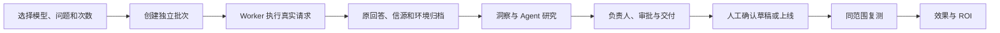

观测、Agent、行动、内容和 ROI 共享同一个工作区与全局数据范围，但各自保留独立的真实状态。

## <a id="quick-start"></a>快速开始

个人电脑版只要求 [Docker Desktop](https://www.docker.com/products/docker-desktop/)，无需额外安装 Node.js、Python、pnpm 或 uv。

### Windows

1. 下载仓库 ZIP 并完整解压。
2. 双击 `Start-GEO-Windows.cmd`。
3. 等待浏览器自动打开注册页。

### macOS

1. 下载仓库 ZIP 并解压。
2. 第一次右键打开 `Start-GEO.command`，选择“打开”。
3. 等待浏览器自动打开注册页。

### Linux / 终端

```bash
./scripts/geo-personal.sh start
```

默认访问 `http://127.0.0.1:3000`。3000 被占用时，启动器会在 3001–3010 中选择空闲端口，不会结束其他程序。

首次进入后：

1. 创建本机管理员和工作区。
2. 在“模型与渠道”中配置自己有权使用的 Provider，先运行连接测试。
3. 先用小范围观测确认费用、速度和证据完整性。

完整安装、停止、诊断、备份和更新说明见 [`START_HERE.md`](START_HERE.md)。

## <a id="deployment"></a>部署方式

| 模式 | 数据库 | 访问范围 | 适用场景 |
|---|---|---|---|
| 个人 Docker 版 | SQLite | 本机 `127.0.0.1` | 个人试用、独立项目 |
| macOS 原生常驻版 | SQLite | 本机 | 开发机长期运行 |
| 局域网团队版 | PostgreSQL | 可信内网 | 同一办公网共享工作区 |
| 云端正式版 | PostgreSQL | HTTPS 域名 | 跨地点团队与正式客户 |

详见 [`docs/local-deployment-modes.md`](docs/local-deployment-modes.md) 和 [`docs/production-deployment.md`](docs/production-deployment.md)。局域网与云端部署必须使用真实终端、权限、备份和恢复流程做上线验收。

## <a id="truth"></a>真实状态原则

```text
Agent 已连接 ≠ 平台账号已登录
某个平台已登录 ≠ 其他平台已登录
草稿写入请求成功 ≠ 草稿真实可见
草稿可见 ≠ 文章已发布
文章已发布 ≠ GEO 效果已改善
```

只有存在数据库记录和可回读证据时，状态才能推进。公开 URL、人工确认、页面回读和可比较复测数据分别证明不同事实，不互相替代。

## 安全与数据

- 不要把 `.env`、数据库、WAL/SHM、备份、Provider Token、私有证据、日志或浏览器会话提交到 Git。
- 个人版数据和证据保存在 Docker 数据卷；停止容器不会删除它们。
- 不要运行 `docker compose down -v`，`-v` 会删除数据卷。
- 办公平台凭证仅用于对应平台的官方 API；界面不会回显完整密钥。
- 系统可以写入已审核草稿，不会自动点击外部平台的最终发布按钮。

## 技术结构

```text
.
├── apps/
│   ├── web/                  # Next.js 产品界面
│   ├── api/                  # FastAPI、SQLAlchemy、Worker 与迁移
│   └── geo-article-assistant-extension/ # 草稿写入浏览器扩展
├── infra/                    # Docker Compose、Nginx 与本机服务
├── scripts/                  # 部署、诊断、审计与验收
├── docs/                     # 产品、Agent、设计与部署文档
├── START_HERE.md             # 使用者安装入口
└── Start-GEO.*               # Windows / macOS 一键启动
```

## <a id="development"></a>开发与验证

开发者先阅读 [`AGENTS.md`](AGENTS.md) 和 [`docs/DEVELOPER_HANDOFF.md`](docs/DEVELOPER_HANDOFF.md)。修改 Agent、优化行动、内容生成、平台适配、草稿同步或复测前，还必须阅读：

- [`docs/agent/CODEX_AGENT_EXECUTION_RUNBOOK.md`](docs/agent/CODEX_AGENT_EXECUTION_RUNBOOK.md)
- [`docs/product/CODEX_AGENT_INTEGRATION_IMPLEMENTATION.md`](docs/product/CODEX_AGENT_INTEGRATION_IMPLEMENTATION.md)
- [`docs/design/codex-agent-priority-actions-ui-spec.md`](docs/design/codex-agent-priority-actions-ui-spec.md)

本地开发：

```bash
pnpm run dev:api
pnpm run dev:web
```

打开 `http://127.0.0.1:39003`。提交前至少运行：

```bash
pnpm run check:api
cd apps/api && PYTHONPATH=. uv run pytest -q
cd ../..
pnpm run build:web
pnpm run check:web
python3 scripts/acceptance_privacy_audit.py
python3 scripts/acceptance_db_audit.py
git diff --check
```

`build:web` 和 `check:web` 应顺序执行，避免争抢 `.next/types`。更多说明见 [`docs/development.md`](docs/development.md)。

## 当前边界

- Provider、Agent 运行时和办公平台需要各自的真实账号与凭证，仓库不附带。
- Docker 容器不会自动继承宿主机上 Codex、Claude、Hermes、OpenClaw 或浏览器的登录态。
- 个人版默认 Worker 并发为 8；实际速度受电脑性能、数据库写入、Provider QPS、额度和限流影响。
- 局域网和云端部署在对外使用前，仍需要针对真实网络、用户和恢复流程验收。

---

<p align="center">
  <strong>入答 AnswerReach</strong><br />
  让每一次观测、判断、行动和结果都能回到证据。
</p>
