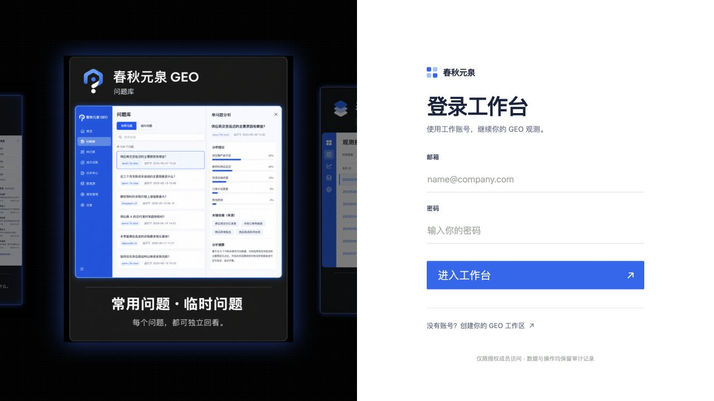
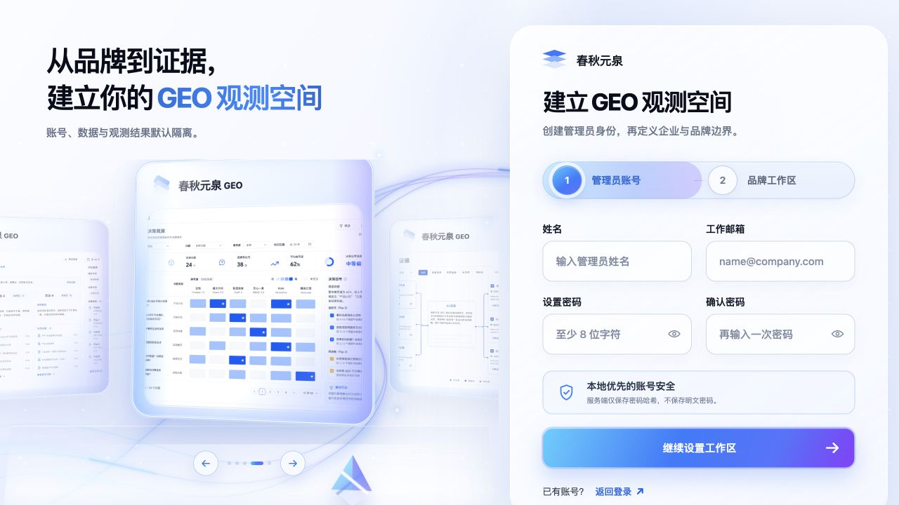

<p align="center">
  
</p>

<h1 align="center">春秋元泉 GEO</h1>

<p align="center">
  <strong>从真实联网观测到可审计内容行动的本地优先 GEO 工作台</strong>
</p>

<p align="center">
  让团队按自己选择的模型、问题与轮次发起观测，保留原始回答和来源，<br />
  再把证据转化为可审核、可交付、可复测的优化行动。
</p>

<p align="center">
  
  
  
  
  
</p>

<p align="center">
  <a href="#product-tour">产品全景</a> ·
  <a href="#quick-start">快速开始</a> ·
  <a href="#how-it-works">工作原理</a> ·
  <a href="#deployment">部署模式</a> ·
  <a href="#security">安全边界</a> ·
  <a href="#development">开发指南</a>
</p>

<p align="center">
  
</p>

> 截图来自当前本地产品的真实页面。批次、指标、Worker 和 Provider 状态会随各自部署的数据与配置变化；截图不代表持续在线承诺，也不代表 GEO 效果已经改善。

## 为什么做春秋元泉 GEO

普通模型调用只能得到一段答案，难以回答更重要的问题：**模型为什么这样回答、引用了哪里、品牌在哪些采购问题中出现、改完之后是否真的发生变化？**

春秋元泉 GEO 把这条链路拆成可验证的产品流程：

- 观测范围由用户当下选择的 **模型 × 问题 × 轮次** 唯一决定。
- Queue Worker 只消费新提交且允许执行的任务，历史批次只读保留、不会自动重跑。
- 每条合格结果归档原始回答、搜索来源、原始响应和采样环境。
- 决策地图、信源地图与竞品对比都从同一份持久化证据计算。
- Codex Agent 只在用户选择真实机会后研究和起草，产物必须进入人工审核。
- 平台写入、最终发布与复测结论彼此分离；最终发布始终由用户在目标平台确认。

## <a id="product-tour"></a>产品全景

### 登录与工作区建立

账号、企业、工作区和成员角色独立隔离。个人版可在本机创建管理员和独立工作区；团队版支持邀请链接与角色权限。

<table>
  <tr>
    <td width="50%"></td>
    <td width="50%"></td>
  </tr>
  <tr>
    <td align="center"><strong>登录工作台</strong><br />授权成员进入对应工作区</td>
    <td align="center"><strong>建立观测空间</strong><br />创建管理员并定义品牌边界</td>
  </tr>
</table>

### 真实观测与决策地图

页面按所选模型、问题和重复次数实时计算任务量。任务只有在 Worker 实际领取后才进入运行中；完成后可逐条回看证据。

<p align="center">
  
</p>

### 信源、竞品与内容闭环

<table>
  <tr>
    <td width="50%"></td>
    <td width="50%"></td>
  </tr>
  <tr>
    <td align="center"><strong>信源地图</strong><br />按域名、页面、模型和问题回到原始证据</td>
    <td align="center"><strong>竞品对比</strong><br />在同一批次口径下比较出现率与位置</td>
  </tr>
  <tr>
    <td width="50%"></td>
    <td width="50%"></td>
  </tr>
  <tr>
    <td align="center"><strong>内容库</strong><br />保留 Agent 版本、事实依据、平台稿与审核状态</td>
    <td align="center"><strong>运营状态</strong><br />区分连接、队列、观测和证据闭环</td>
  </tr>
</table>

## 核心能力

| 能力 | 产品行为 | 真实性边界 |
|---|---|---|
| 多模型真实观测 | 按模型 × 问题 × 轮次生成独立任务 | 创建队列任务不等于模型调用完成 |
| 统一证据台账 | 保存原始回答、来源 URL、原始响应和采样环境 | 缺少必要证据的结果不进入指标 |
| 决策地图 | 展示自然提及、候选、推荐、引用与事实核验状态 | 事实准确率不由模型自行猜测 |
| 信源地图 | 聚合来源域名与具体页面，并回链原回答 | URL 被引用不等于页面已经被核验 |
| 竞品对比 | 在相同筛选范围内计算品牌出现率、位置与对比信号 | 真实 0 会保留，不用模拟数据补位 |
| 问题与行动 | 从已完成批次中选择有证据的优先机会 | 未运行 Codex 分析时不会伪造机会卡 |
| 内容研究与起草 | 生成母稿、Claim 清单与平台差异稿 | Agent 输出只到待审核，不自动发布 |
| 工作区协作 | owner / admin / operator / reviewer / viewer 角色隔离 | 非成员不能访问其他工作区 |
| 运行状态 | 展示 Worker 心跳、可执行队列、失败原因和证据闭环 | Worker 在线只代表队列可被消费 |

```mermaid
flowchart LR
    A["用户选择模型、问题和轮次"] --> B["创建本次新批次"]
    B --> C["Queue Worker 领取可执行任务"]
    C --> D["Provider API 与联网搜索"]
    D --> E["真实性门禁"]
    E --> F["原始回答、来源与工件归档"]
    F --> G["决策地图 / 信源地图 / 竞品对比"]
    G --> H["用户启动 Codex 机会分析"]
    H --> I["研究、母稿与平台适配稿"]
    I --> J["人工逐稿审核"]
    J --> K["用户在目标平台确认草稿与发布"]
    K --> L["同范围复测"]
```

## <a id="how-it-works"></a>工作原理



系统刻意不合并以下状态：

```text
连接测试通过 ≠ 真实观测完成
Agent 已连接 ≠ 内容已经生成
草稿生成完成 ≠ 草稿已写入平台
平台返回候选链接 ≠ 用户已确认草稿可见
草稿可见 ≠ 已发布
已发布 ≠ GEO 效果已改善
```

## <a id="quick-start"></a>同事下载后直接使用

个人电脑版只要求 [Docker Desktop](https://www.docker.com/products/docker-desktop/)，不需要本机安装 Node.js、Python、pnpm 或 uv。

### Windows

1. 从 GitHub 下载 ZIP 并完整解压。
2. 双击 `Start-GEO-Windows.cmd`。
3. 等待浏览器自动打开注册页。

### macOS

1. 从 GitHub 下载 ZIP 并解压。
2. 第一次右键打开 `Start-GEO.command`，选择“打开”。
3. 等待浏览器自动打开注册页。

### Linux / 终端

```bash
./scripts/geo-personal.sh start
```

默认入口：

```text
http://127.0.0.1:3000
```

如果 3000 被占用，启动器会在 3001–3010 中选择空闲端口，不会结束其他程序。首次进入后：

1. 注册本机管理员账号和工作区。
2. 在“模型与渠道”中配置自己有权使用的 Provider，并先做连接测试。
3. 回到决策地图，只提交当前页面选定的模型、问题与轮次。

完整安装、停止、状态检查、备份和更新说明见 [`START_HERE.md`](START_HERE.md)。

## <a id="deployment"></a>部署模式

| 模式 | 数据库 | 访问范围 | Worker | 适用场景 |
|---|---|---|---|---|
| 个人 Docker 版 | SQLite | 仅 `127.0.0.1` | 默认 8，并受 Provider QPS 与 SQLite 写入限制 | 同事各自在电脑独立使用 |
| macOS 原生常驻版 | SQLite | 仅本机 | 由 LaunchAgent 保持 Web / API / Worker，同样受实际资源限制 | 开发机长期本地使用 |
| 局域网团队版 | PostgreSQL | 可信内网 | 中央 Worker 最多 125 个并发槽 | 同一办公室共享账号与证据 |
| 云端正式单机版 | PostgreSQL | 指定 HTTPS 域名 | 默认 32，可按服务器和 Provider 限额调整 | 跨地点团队与早期正式客户 |

局域网模式的代码和配置已经提供，但仍应在正式内部投用前完成两台真实电脑的端到端验收。不要把端口直接映射到公网；跨办公地点优先使用公司 VPN、Tailscale 或正式 HTTPS 反向代理。

本机与内网边界详见 [`docs/local-deployment-modes.md`](docs/local-deployment-modes.md)；云端一键部署、备份和扩容边界详见 [`docs/production-deployment.md`](docs/production-deployment.md)。

## Provider 与联网能力

平台为 DeepSeek、豆包、通义千问、智谱 GLM、Kimi 与腾讯混元提供配置入口和对应协议适配。每一家是否可用于真实观测，取决于当前部署中的：

- 官方账号与 API Key 是否有效；
- 模型名、API 地址和搜索增强参数是否匹配官方协议；
- Provider QPS、额度与 429 限流；
- 最近一次联网测试及完整证据门禁是否通过。

“配置入口存在”或“普通 API 能回答”都不能证明官方搜索工具已经工作。运营状态页会把未配置、连接通过、待完成观测和产品闭环通过分开显示。

## <a id="security"></a>密钥、隐私与数据边界

- GitHub 仓库不应包含任何真实 `.env`、数据库、WAL、备份、Provider Token、私有证据、日志、登录态、`node_modules` 或 `.next`。
- 个人版配置保存在稳定的本机用户目录；已有配置不会在更新或重新解压时被覆盖。
- 数据库和证据保存在 Docker 数据卷；停止容器或更换代码目录不会自动删除数据。
- 不要运行 `docker compose down -v`，它会删除个人数据卷。
- 备份会将数据库、证据和本机配置整体认证加密；加密文件和独立 `backup.key` 必须分开保管，不得上传 GitHub 或转发。
- Local Agent V1 只上报设备、EgoLite 与 Codex 的非敏感健康状态，不提供远程 Shell。
- 最终发布仍需用户在目标平台确认；系统不会把同步请求接受写成“已经发布”。

常用本机入口：

| 目的 | Windows | macOS |
|---|---|---|
| 启动 | `Start-GEO-Windows.cmd` | `Start-GEO.command` |
| 状态检查 | `Status-GEO-Windows.cmd` | `Status-GEO.command` |
| 停止并保留数据 | `Stop-GEO-Windows.cmd` | `Stop-GEO.command` |
| 备份 | `Backup-GEO-Windows.cmd` | `Backup-GEO.command` |

## 项目结构

```text
.
├── apps/
│   ├── web/                  # Next.js 产品界面
│   └── api/                  # FastAPI、SQLAlchemy、Worker 与迁移
├── infra/                    # Docker Compose、Nginx 与 LaunchAgent
├── scripts/                  # 部署、诊断、采集与验收脚本
├── docs/                     # 产品、设计、Agent 与部署文档
├── START_HERE.md             # 同事安装的唯一入口
└── Start-GEO.*               # Windows / macOS 一键启动器
```

## <a id="development"></a>开发与验证

开发者先阅读：

- [`AGENTS.md`](AGENTS.md)
- [`docs/DEVELOPER_HANDOFF.md`](docs/DEVELOPER_HANDOFF.md)
- [`docs/agent/CODEX_AGENT_EXECUTION_RUNBOOK.md`](docs/agent/CODEX_AGENT_EXECUTION_RUNBOOK.md)
- [`docs/product/CODEX_AGENT_INTEGRATION_IMPLEMENTATION.md`](docs/product/CODEX_AGENT_INTEGRATION_IMPLEMENTATION.md)
- [`docs/design/codex-agent-priority-actions-ui-spec.md`](docs/design/codex-agent-priority-actions-ui-spec.md)

本地开发：

```bash
pnpm run dev:api
pnpm run dev:web
```

打开 `http://127.0.0.1:39003`。提交前运行：

```bash
pnpm run check:api
pnpm run check:web
pnpm run build:web
pnpm run verify:local
```

更多开发说明见 [`docs/development.md`](docs/development.md)。

## 当前产品边界

- Docker 个人版可独立运行 Web、API、SQLite 和采集 Worker。
- 本机 Codex、EgoLite 或其他桌面登录态不会自动进入 Docker 容器；相关功能必须单独配置并通过真实诊断。
- 局域网团队版尚未完成两台真实电脑的正式验收，不能宣称已经完成生产部署。
- Agent 只生成和保存可审核产物；最终平台发布与可比复测需要人工完成。
- 任何“已完成”状态都必须能够回读数据库记录和对应证据。

---

<p align="center">
  <strong>春秋元泉 GEO</strong><br />
  让每一次观测、判断与行动都能回到证据。
</p>
