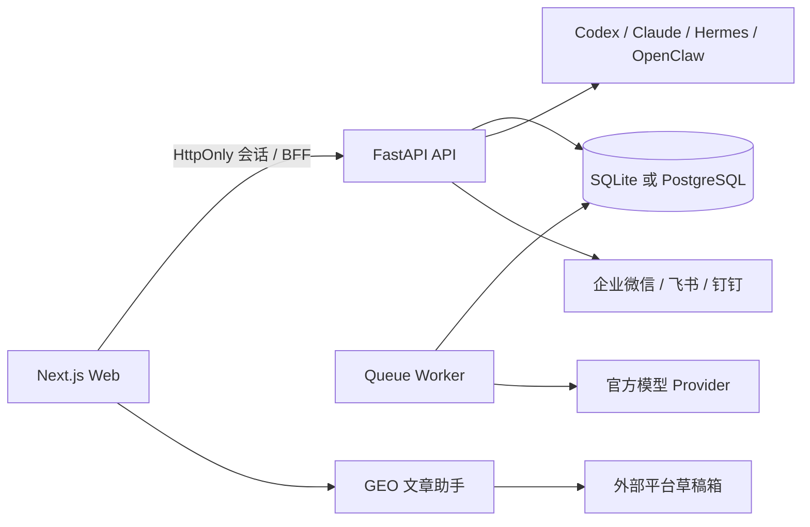

# 开发者指南

## 一句话理解

春秋元泉 GEO 是一个“用真实模型回答发现问题→用证据生成行动→人工审核和发布→同口径复测”的工作台。它不是聊天软件，也不是自动发布机器。



## 运行边界

- Web 只保存 HttpOnly 会话 Cookie，通过 BFF 转发 API；浏览器拿不到内部代理密钥。
- API 负责权限、工作流、审计和真实状态；前端本地状态不能把任务伪装成已完成。
- Worker 只领取数据库中可执行的队列任务。开发验证默认不创建付费模型调用。
- 文章助手只写草稿。每次外部写入必须在扩展弹窗中人工核对平台、账号和标题；绝不点击最终发布。
- 企业微信、飞书、钉钉连接成功只说明官方接口接受了请求，不代表成员已读。

## 代码地图

| 位置 | 责任 | 修改前要注意 |
|---|---|---|
| `apps/web` | Next.js 页面、BFF 和会话 | 不在客户端伪造完成状态；写请求必须同源 |
| `apps/api/app/api` | 传统项目、内容、交付等 API | 所有项目路由都要做企业隔离 |
| `apps/api/app/v1` | GEO 工作区、观测、行动、协作与 Agent | 所有工作区路由都要做成员权限 |
| `apps/api/app/services` | Provider、Agent、安全和外部集成 | 子进程不继承整个 API 环境；路径由部署者决定 |
| `apps/api/migrations` | Alembic 前向迁移 | 不删库、不自动重建；先在隔离 SQLite/PostgreSQL 测试 |
| `apps/geo-article-assistant-extension` | 登录检测和草稿写入 | 修改后必须重新打包、工件审计和 smoke |
| `infra` / `scripts` | 个人、局域网、云端部署与备份 | 镜像必须锁定 digest；备份只留认证加密密文 |

## 本地开发

在仓库根目录分别运行：

```bash
pnpm run dev:api
pnpm run dev:web
```

- Web：`http://127.0.0.1:39003`
- API：`http://127.0.0.1:8000`
- 真实数据库：`apps/api/geo_platform.db`

不要复制、删除、初始化或提交真实数据库。修改表结构时：新建迁移→隔离 SQLite 测试→隔离 PostgreSQL 测试→为真库加密备份→`alembic upgrade head`→完整性审计。

## 必跑验证

```bash
pnpm run check:api
cd apps/api && PYTHONPATH=. uv run pytest -q
cd ../.. && pnpm run build:web
pnpm run check:web
python3 scripts/acceptance_architecture_audit.py
python3 scripts/acceptance_privacy_audit.py
python3 scripts/acceptance_db_audit.py
python3 scripts/acceptance_extension_artifact.py
node apps/geo-article-assistant-extension/tests/smoke.mjs
git diff --check
```

`build:web` 和 `check:web` 必须串行，否则可能争抢 `.next/types`。最后还要用 EgoLite 检查受影响页面、登录态、加载、保存回读和错误提示。

## 当前维护债务

产品主链已可运行，但代码中仍有几个超大聚合文件，特别是 `apps/api/app/v1/routes.py`、`apps/web/src/lib/cleanroom-v1-api.ts` 和部分项目详情页。后续功能应按“观测 / 行动 / 内容 / 协作 / 运营”拆分，不再向大文件继续堆入新业务。拆分时先保持路由、响应和数据不变，再做界面优化。
