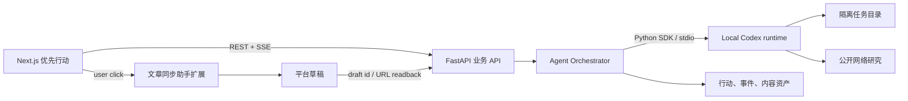
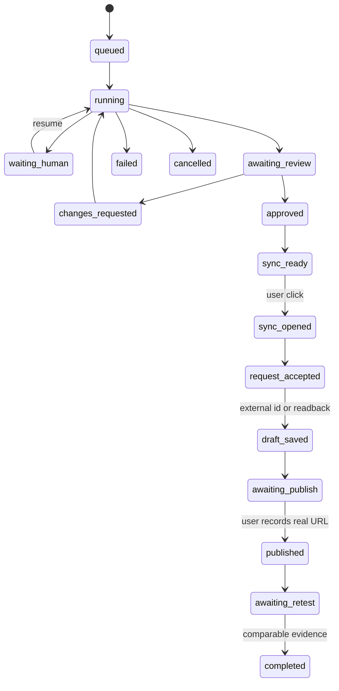

# 春秋元泉 GEO × 本机 Codex Agent 技术实现说明

> 版本：1.1 · 更新：2026-08-08
> 状态：P0 已实现；P1 的人工审核、浏览器同步触发和结果归档已实现，真实外部平台草稿验收待用户操作。

## 先说结论

最轻量、也最适合当前 FastAPI + Next.js 项目的方案是：

**在 FastAPI 内部通过官方 Python SDK 启动本机 Codex，复用这台 Mac 已有的 ChatGPT/Codex 登录；前端只连接我们自己的 API 和事件流；文章同步助手仍然由用户点击后在浏览器里确认写入草稿。**

这个方案不要求用户再配置 ChatGPT 中转站 Key，不要求浏览器填 MCP Server 路径，也不把能执行命令的 Agent 端口暴露给网页。



## 1. 我们先看了其他开源项目怎么做

| 项目 | 它的实际做法 | 我们借鉴 | 我们不直接照搬的原因 |
|---|---|---|---|
| [OpenAI Codex App Server](https://github.com/openai/codex/blob/main/codex-rs/app-server/README.md) | 用 Thread → Turn → Item 表达 Agent 会话，以双向 JSON-RPC 流式输出步骤、命令和审批；`stdio` 是默认传输，WebSocket 被标为实验性/不受支持 | 会话、流式事件、中断、审批、结构化输出 | 不让前端直连 App Server；我们的业务 API 必须掌握权限、数据和真实状态 |
| [OpenAI Codex Python SDK](https://github.com/openai/codex/tree/main/sdk/python) | Python 程序可启动/恢复 thread、运行 turn、读取流式进度和 token 用量，并复用现有 Codex 认证 | FastAPI 直接接入，不新建 Node 中间层；不要求再填 API Key | 不让 SDK 直接写业务表；仍由 Orchestrator 校验和落库 |
| [OpenCode](https://github.com/anomalyco/opencode) | 本地 server + SDK + SSE，会话事件有实时流和可恢复的持久流 | UI 只显示已持久化的权威状态；断线后用 sequence 续传 | 不再启一套 OpenCode。其安全公告曾披露未认证本地 HTTP 端口可执行命令，所以我们坚持后端内部 `stdio` 边界：[GHSA-vxw4-wv6m-9hhh](https://github.com/anomalyco/opencode/security/advisories/GHSA-vxw4-wv6m-9hhh) |
| [goose](https://github.com/aaif-goose/goose) | 提供 CLI、Desktop 和 API，支持多模型和扩展；用 `AGENT_SESSION_ID` 给 STDIO 扩展和命令做会话隔离 | 每一个 GEO 行动只对应一个 Agent run 和独立目录；所有工件带 run ID | 支持15+模型对当前产品不是必要价值，会增加凭据、支持和运维成本 |
| [OpenHands Agent Canvas](https://github.com/OpenHands/OpenHands) | 前端连接一个或多个 Agent Server，支持本机、Docker、VM 和 ACP 兼容 Agent | 将「业务页」与「Agent 运行状态」分层，并显示审批/阻塞 | 它是完整 Agent 控制台，本机直跑会拥有广泛文件权限，Docker/远端又引入明显更重的部署 |

调研得出的共同规律是：**前端不应把 Agent 当成一个“返回文字的 API”，而应把它当成一个有会话、事件、工件、中断和人工门禁的运行时。**

## 2. 现有代码不推倒，只补 Agent 运行层

当前仓库已有：

- 确定性机会发现：`app/v1/action_opportunities.py`；
- 机会、行动、事件、Brief、母稿、Claim、平台稿、审核、分发和复测数据表；
- 真实观测证据门禁；
- 内容生成队列与私有工件归档；
- 文章同步助手的人工确认入口。

现在的主要不足：

- `geo_content.generate` 只是一次模型调用，不会展示研究和验证步骤；
- 平台适配目前只是确定性包装，不是真实的「查规则 → 改写 → 校验」；
- 没有 Codex thread ID、run ID、有序事件和可中断/恢复的状态；
- 设置页的 DeepSeek/MCP 配置把「内容生成」和「文章同步」混在一起，用户必须理解不必要的底层路径。

因此实施原则是：**保留全部业务表和真实性门禁，新增 `AgentRuntimeAdapter`，用 Codex 替换单次生成执行器，不替换业务系统。**

## 3. 实现分层

### 3.1 AgentRuntimeAdapter

```python
class AgentRuntimeAdapter(Protocol):
    async def diagnose(self) -> RuntimeHealth: ...
    async def start(self, task: AgentTask) -> AgentRunHandle: ...
    async def resume(self, run: AgentRun) -> AgentRunHandle: ...
    async def interrupt(self, run: AgentRun) -> None: ...
    async def events(self, run: AgentRun, after: int = 0) -> AsyncIterator[AgentEvent]: ...
```

v1 只实现 `LocalCodexRuntime`：

- 使用 `openai-codex` Python SDK；
- 复用现有 Codex 登录，不把 token 存入业务库；
- 底层走 `stdio`，只有 API 进程可访问；
- 每个行动一个 thread，可 resume，不共用对话上下文；
- 默认 `workspace-write`，cwd 仅限当次任务目录；
- 默认不允许 shell 写入业务仓库，不允许触发发布。

保留 adapter 接口是为了避免锁死产品，不是 v1 同时支持多套 Agent。

### 3.2 Agent Orchestrator

Orchestrator 只做六件事：

1. 从数据库组装最小任务快照；
2. 建立隔离任务目录；
3. 启动/恢复/中断 Codex thread；
4. 把 Codex 原始 item 映射为用户可理解的阶段事件；
5. 校验 `result.json` 与 claim manifest；
6. 通过服务层写入现有内容资产表。

Agent 无权直接连 SQLite。

### 3.3 任务目录

```text
apps/api/private_artifacts/agent-runs/{workspace_id}/{run_id}/
├── input/task.json
├── input/evidence.json
├── input/brand-facts.json
├── input/platform-policies.json
├── output/result.json
├── output/master.md
├── output/variants/{platform}.md
├── output/assets/
└── logs/events.jsonl
```

这些目录已在私有工件边界内，不进 Git。数据库只存路径、摘要、哈希和状态。

## 4. 数据库最小增量

不重做内容表，只新增三个 Agent 表：

### `geo_agent_runs_v1`

| 字段 | 用途 |
|---|---|
| `workspace_id`, `action_id`, `brief_id` | 挂到现有业务对象 |
| `runtime_key` | v1 固定 `local_codex` |
| `external_thread_id` | 恢复 Codex 会话，不含凭据 |
| `status`, `phase`, `percent` | 页面权威状态 |
| `input_fingerprint` | 去重和幂等 |
| `last_event_sequence` | SSE 断线续传 |
| `output_asset_id` | 指向已校验的母稿 |
| `started_at`, `finished_at`, `failure_code` | 运行审计 |

### `geo_agent_events_v1`

`run_id + sequence` 唯一，保存 `event_type` / `phase` / `status` / `label` / 脱敏 `detail` / `occurred_at`。原始 Codex 事件先脱敏再归档，不保存凭据。

### `geo_agent_artifacts_v1`

保存 `kind` / `uri` / `sha256` / `source_url` / `mime_type` / `metadata`。内容可以是平台规则快照、官网截图、母稿、平台稿或结构化结果。

## 5. API 设计

| 方法 | 路径 | 意义 |
|---|---|---|
| `GET` | `/api/v1/workspaces/{id}/agent-runtime` | 版本、登录、可用模型、当前健康；不返回 token |
| `POST` | `/api/v1/workspaces/{id}/agent-runtime/test` | 运行一个无写入的结构化自检 |
| `POST` | `/api/v1/workspaces/{id}/actions/{action_id}/agent-runs` | 从已选机会和 Brief 启动生成 |
| `GET` | `/api/v1/workspaces/{id}/agent-runs/{run_id}` | 读取权威运行状态 |
| `GET` | `/api/v1/workspaces/{id}/agent-runs/{run_id}/events?after=17` | SSE 事件流，支持续传 |
| `POST` | `/api/v1/workspaces/{id}/agent-runs/{run_id}/interrupt` | 用户中止，保留已归档工件 |
| `POST` | `/api/v1/workspaces/{id}/agent-runs/{run_id}/resume` | 从原 thread 继续 |
| `POST` | `/api/v1/workspaces/{id}/content-assets/{asset_id}/reviews` | 人工通过/退回，每个平台稿独立审核 |
| `POST` | `/api/v1/workspaces/{id}/distribution-runs` | 仅为已审核稿创建同步任务 |
| `POST` | `/api/v1/workspaces/{id}/distribution-runs/{run_id}/client-results` | 归档同步助手返回的逐平台结果 |

启动 Agent run 必须有幂等键。同一行动已有 `queued/running/waiting_human` run 时，不得再建第二个并行 run。

## 6. 业务状态机

Agent 状态与发布状态必须分开：



不得跳过：

- `awaiting_review → approved`：必须是用户操作；
- `sync_ready → sync_opened`：必须是用户点击；
- `request_accepted → draft_saved`：必须有草稿 ID/URL 或真实回读；
- `awaiting_publish → published`：必须有人工确认的真实发布 URL；
- `awaiting_retest → completed`：必须有同问题、同模型集的有效复测证据。

## 7. 设置页应该怎么改

删除对普通用户暴露的「DeepSeek API Key」和「MCP Server 文件路径/Token」主流程。改成两个能力状态：

### 本机 Codex Agent

显示：

- 运行时版本；
- 已登录/未登录（不显示 token）；
- 当前模型与 reasoning effort；
- 最近自检结果与耗时；
- 「测试 Codex Agent」和「重新登录」。

“测试”只能说明 runtime 可用，不能说明平台研究、内容生成或草稿同步已通过。

### 文章同步助手

显示「浏览器扩展，按需检测」，不要求服务器路径或 token。账号登录态只在用户点击「打开同步助手」后由扩展返回，不做后台定时探测。

## 8. 内容生成系统提示词

提示词不写死在 Python 字符串里。使用版本化文件：

```text
apps/api/app/agent_prompts/
├── geo_content_research.v1.md
├── geo_master_draft.v1.md
├── platforms/zhihu.v1.md
├── platforms/wechat.v1.md
├── platforms/juejin.v1.md
├── platforms/csdn.v1.md
└── result.schema.json
```

系统提示词的强制顺序：

1. 读取任务契约和禁止项；
2. 先查目标平台官方规则；
3. 再查春秋元泉官网和已确认事实；
4. 建立 claim manifest；
5. 写母稿；
6. 逐平台适配；
7. 对比事实一致性；
8. 只交付到「待人工审核」。

完整执行规约见 [`docs/agent/CODEX_AGENT_EXECUTION_RUNBOOK.md`](../agent/CODEX_AGENT_EXECUTION_RUNBOOK.md)。

## 9. 前端交互决策

一屏只回答三个问题：

1. 现在最值得做什么；
2. Codex 正在做什么，是否需要我；
3. 草稿现在处于审核、同步、发布还是复测阶段。

页面不做一个通用 ChatGPT 聊天框。用户的主操作是选择一条有证据的机会，然后对 Agent 产出做审核与发布决策。

完整界面规格和原型见：

- [`docs/design/codex-agent-priority-actions-ui-spec.md`](../design/codex-agent-priority-actions-ui-spec.md)
- [`docs/design/codex-agent-priority-actions-ui.html`](../design/codex-agent-priority-actions-ui.html)
- [`docs/design/codex-agent-priority-actions-ui.jpg`](../design/codex-agent-priority-actions-ui.jpg)

## 10. 分期实施

### P0：先让 Agent 真正跑起来

- 安装并锁定 `openai-codex` Python SDK；
- 实现 diagnose/start/events/interrupt；
- 新增 Agent run/event/artifact 表与 API；
- 用一条真实机会生成母稿和两个平台稿；
- 界面实时显示阶段和阻塞；
- 无人工审核时绝不进入同步。

### P1：补齐人工审核和文章同步助手

- 母稿/平台稿对比、Claim 依据和修订记录；
- 用户勾选平台后启用「打开同步助手」；
- 浏览器扩展客户端桥接，逐平台返回结果；
- 草稿 ID/URL 回读和真实状态入库。

### P2：复测与产品化

- 发布 URL 人工归档；
- 同问题/同模型集复测；
- 产出 improved / unchanged / regressed / insufficient evidence；
- Agent 并发、配额、超时、可观测性和恢复。

实施状态（2026-08-08）：公开 URL 人工归档、同问题/同模型/同重复次数复测、证据差值和四类结论已经落地。Agent 默认实施工作区级 `1` 个活动 run 容量、15 分钟单次超时、SDK `interrupt`、排队取消竞态收敛和原 thread 恢复；页面直接显示容量、时限和可恢复操作。最终发布仍由人工在平台侧完成。跨进程分布式调度不属于当前单机产品范围。

官网可引用性审计现已作为独立 `website_audit` 来源进入优先行动：相同问题码确定性去重，机会保存审计 ID、原始 HTML 哈希和工件清单，不伪装成模型回答。选择该机会后，Codex 只能生成 `official_site` 待审核稿；文章同步助手不会接收官网稿，审核通过也不会显示为已上线。

审计约束：复测创建时会保存当时的发布目标和公开 URL；真实复测批次建立后，这些 URL 不得原地覆盖。需要更正时应在复测前完成，或保留旧行动并创建新的发布行动，确保前后证据链可复核。

## 11. 验收标准

P0 只有同时满足以下条件才算完成：

- 真实 Codex 运行返回 thread ID，不是 mock；
- 页面断线重连后能从最后 sequence 恢复进度；
- 母稿与至少两个平台稿持久化，并显示不同结构和语气；
- 所有关键事实都有 claim 依据，无依据项显示待确认；
- 点击中止后底层 turn 真正停止，状态不显示完成；
- 未人工通过的稿件不能进入文章同步助手；
- 没有新密钥、数据库、日志或私有工件进入 Git。

## 12. 现在不做的事

- 不为一个工作区同时接 OpenCode、Goose、OpenHands 和 Codex；
- 不做通用 Agent 聊天产品；
- 不让 Agent 直连数据库或修改仓库代码；
- 不在网页暴露能执行命令的本地 Agent 端口；
- 不自动发布，不自动点赞/评论/私信；
- 不把模型生成、同步请求或连接测试计入 GEO 成效。
