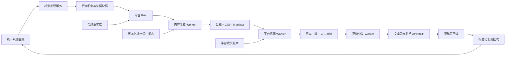
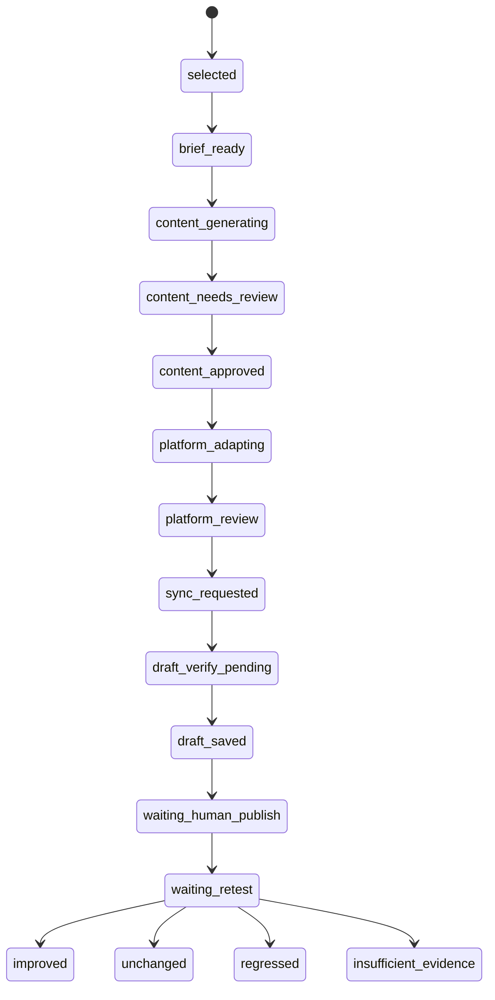

# 春秋元泉 GEO「优先行动」后端技术实现设计 v2

> 状态：待实施，本文档不代表任何接口已接入或能力已上线  
> 日期：2026-08-07（Asia/Shanghai）  
> 设计基线：`main@58908f4`  
> 适用范围：`/geo/{workspaceId}/actions` 从真实问题发现、内容生成、分平台适配、草稿同步到下一轮复测的后端闭环。  
> 前置文档：[`priority-actions-publishing-loop-v1.md`](./priority-actions-publishing-loop-v1.md)

## 1. 结论

「优先行动」必须从当前的前端机会列表，升级为一条由真实证据驱动的后端工作流：

```text
真实观测证据
→ 确定性缺口识别
→ 持久化行动机会
→ 用户选择行动
→ 证据和品牌事实约束的内容简报
→ AI 母稿
→ 分平台适配稿
→ 事实校验与人工审核
→ 文章同步助手写入草稿
→ 真实草稿页回读
→ 人工发布
→ 同问题、同模型、同重复次数复测
→ improved / unchanged / regressed / insufficient_evidence
```

API Key 只用于两类真实外部调用：

1. 内容生成模型：生成 brief 摘要、母稿和平台适配稿；
2. 观测模型：下一轮真实联网复测。

行动发现、优先级、事实匹配、状态机、差值计算不交给 AI，不需要 API Key。文章同步助手使用独立的服务凭证，它不是模型 API Key，也不代表外部平台已登录或草稿已保存。

## 2. 当前基线与真实缺口

当前代码已有：

- `POST/GET/PATCH /api/v1/workspaces/{workspace_id}/actions`；
- `POST /api/v1/workspaces/{workspace_id}/actions/{action_id}/re-observations`；
- 观测批次、队列 Worker、真实回答、搜索事件、来源 URL 和原始工件入库；
- 前端根据已入库证据临时推导候选缺口。

当前缺口：

- 机会识别在 TypeScript 页面层执行，没有批次范围、指纹、优先级版本和持久化结果；
- 行动只有 `proposed / in_progress / verified / closed`，无法表达内容、审核、平台适配、草稿回读和复测；
- 「生成真实内容」当前只把行动改为 `in_progress`，没有生成任务和内容资产；
- 当前复测接口只能绑定一条已经存在的 run/evidence，不会创建可比复测批次；
- 「草稿待确认」「写入草稿」等前端文案与真实数据实体尚未对应。

不应将旧 `Project` 域的 `article_workflow.py` 直接绑到 clean-room 工作区。可以复用其「草稿—审核—修订」的概念，但新表、新路由和新权限必须以 `GeoWorkspace` 为边界。

## 3. 设计原则

| ID | 不可破坏的原则 | 服务端约束 |
|---|---|---|
| INV-01 | 真实问题发现不依赖模型自评 | 机会类型、样本数、比率和优先级由确定性程序计算 |
| INV-02 | 不合格观测不进入行动指标 | 只使用含最终回答、搜索事件、来源对象/URL、原始工件的有效真实证据 |
| INV-03 | AI 不得新增未经验证的产品能力、数字、客户或背书 | 所有事实声明必须绑定 `brand_fact_id` 或证据来源，未匹配声明进入 `needs_review` |
| INV-04 | 分平台调性调整不能改变事实 | 母稿的 claim manifest 是锁定输入，适配稿只允许改变标题、导语、段落组织、语气和平台元数据 |
| INV-05 | 同步请求成功不等于草稿保存成功 | 请求接受只记录 `mcp_request_accepted`，真实草稿页回读后才可写入 `draft_saved` |
| INV-06 | 系统不自动发布 | 最终发布动作不存在于普通 Worker 任务中，只能由人工明确授权 |
| INV-07 | 复测必须可比 | 原问题、模型集、重复次数、指标版本和样本资格必须一致，版本漂移单独显示 |
| INV-08 | 密钥不进业务表、任务 payload、日志和提交 | 业务对象只存 `provider_id` 或 `secret_ref`，运行时由密钥提供层解析 |

## 4. 总体架构



后端按领域拆分：

- `action_discovery`：读取观测台账，计算并持久化机会；
- `content_planning`：组装证据、事实、来源目标和编辑约束；
- `content_generation`：调用内容模型，生成结构化母稿和 claim manifest；
- `platform_adaptation`：按平台政策生成独立适配稿；
- `content_review`：确定性事实校验和人工审核；
- `distribution`：通过文章同步助手写入草稿，并等待回读；
- `retest`：重用统一观测批次和 Worker，计算可比差值。

## 5. 真实问题发现服务

### 5.1 输入与资格门禁

`discover` 请求必须显式传入：

- `batch_id` 或明确时间范围；
- `provider_ids` / `model_keys`；
- `question_plan_ids`；
- `baseline_brand_entity_id`；
- `minimum_samples_per_model_question`，默认 3；
- `discovery_version`。

只有同时满足以下条件的 `GeoEvidence` 才可进入计算：

- `is_real_provider_evidence = true`；
- `collection_method` 为通过门禁的联网观测方法；
- 最终回答非空；
- 搜索事件数大于 0；
- `source_items` 非空且含有效 URL；
- `raw_artifact_uri` 存在且对应工件可读；
- 任务与批次状态为真实完成，不接受 pending/running。

当样本不足时，保存 `insufficient_evidence` 机会或不产生正式行动，不得让 AI 补齐结论。

### 5.2 v1 机会类型

| 机会类型 | 确定性判定 | 最小证据 |
|---|---|---|
| `candidate_gap` | 竞品进入候选/推荐，品牌缺席 | 同问题同范围至少 3 条合格回答 |
| `citation_gap` | 同类产品或竞品有真实引用，品牌可控内容未被引用 | 至少 1 个去重来源 URL 且品牌引用数为 0 |
| `fact_gap` | 回答反复需要的采购事实不存在于已确认事实库 | 需人工确认后才可转成内容行动 |
| `format_gap` | 引用内容显著集中在 FAQ/对比表/案例/数据说明等形态 | 形态分类须保留来源 URL 与规则版本 |
| `distribution_gap` | 已有审核内容，但高频引用平台无可访问版本 | 必须有内容资产 ID 和目标平台 |
| `crawlability_gap` | 自有页面存在，但可访问性、结构或可引用性检查失败 | 须有目标 URL 和审计结果，不可只从模型未引用推断 |

### 5.3 优先级和去重

优先级由可解释规则计算，推荐权重：

```text
priority_score = evidence_strength * 0.25
               + business_value * 0.20
               + gap_magnitude * 0.20
               + source_reuse_value * 0.15
               + executability * 0.10
               + timeliness * 0.10
               - risk_penalty
```

机会指纹：

```text
sha256(workspace_id
     | question_plan_id
     | opportunity_type
     | source_gap_type
     | recommended_asset_type
     | target_platform_group
     | discovery_version)
```

新批次命中同指纹时只追加证据快照、趋势和优先级版本，不重复创建机会。

## 6. 数据模型

新增迁移建议命名：`202608xx_0018_priority_action_backend.py`。不修改、替换或重新初始化当前数据库。

### 6.1 机会与行动

`geo_action_opportunities_v1`：

- `id`, `workspace_id`, `fingerprint` 唯一索引；
- `opportunity_type`, `title`, `summary`；
- `priority_score`, `priority_label`, `evidence_strength`；
- `source_gap_type`, `recommended_asset_type`, `recommended_platforms`；
- `scope_snapshot`, `rule_version`, `status`；
- `first_seen_batch_id`, `latest_seen_batch_id`, `created_at`, `updated_at`。

`geo_action_opportunity_evidence_v1`：

- `opportunity_id`, `batch_id`, `observation_task_id`, `evidence_id`；
- `question_plan_id`, `provider_id`, `model_key`；
- `signal_type`, `signal_value`, `evidence_hash`；
- `source_url`, `competitor_entity_id`（可空）。

扩展 `geo_optimization_actions_v1`：

- `opportunity_id`, `source_target_id`；
- `stage`, `baseline_snapshot`, `selected_scope`；
- `selected_at`, `completed_at`, `blocked_reason`；
- 保留旧 `status` 用于迁移兼容，由服务端映射，前端不再任意 PATCH。

`geo_action_events_v1`：

- `action_id`, `event_type`, `from_stage`, `to_stage`；
- `actor_type`, `actor_user_id`, `job_id`；
- `detail_json`, `created_at`。

### 6.2 Brief、母稿与事实声明

`geo_content_briefs_v1`：

- `action_id`, `question_plan_id`, `source_target_id`；
- `audience`, `intent`, `asset_type`, `required_sections`；
- `brand_fact_ids`, `evidence_ids`, `source_urls`；
- `required_claims`, `forbidden_claims`, `open_questions`；
- `prompt_template_id`, `input_fingerprint`, `status`。

`geo_content_assets_v1`：

- `brief_id`, `workspace_id`, `version`, `title`, `summary`, `body_markdown`；
- `content_fingerprint`, `model_provider_id`, `model_name`；
- `prompt_template_id`, `prompt_hash`, `raw_artifact_uri`；
- `generation_usage`, `status: generating / draft / needs_review / approved / superseded`。

`geo_content_claims_v1`：

- `content_asset_id`, `claim_key`, `claim_text`；
- `support_type: brand_fact / evidence / editorial`；
- `support_id`, `source_url`, `verification_status`；
- `introduced_by_model`, `review_note`。

### 6.3 平台适配、审核与分发

`geo_platform_variants_v1`：

- `content_asset_id`, `platform_key`, `policy_version`；
- `title`, `summary`, `body_markdown`, `tags`, `category`；
- `image_manifest`, `adaptation_contract`, `content_fingerprint`；
- `prompt_template_id`, `prompt_hash`, `status`；
- 唯一约束：`content_asset_id + platform_key + version`。

`geo_content_reviews_v1`：

- `subject_type: master / platform_variant`；
- `subject_id`, `review_type: deterministic / human`；
- `verdict`, `checks`, `issues`, `reviewer_id`, `created_at`。

`geo_distribution_runs_v1`：

- `workspace_id`, `action_id`, `content_asset_id`；
- `requested_platforms`, `stage: write_draft_only`；
- `idempotency_key`, `status`, `requested_by_user_id`。

`geo_distribution_targets_v1`：

- `distribution_run_id`, `platform_variant_id`, `platform_key`；
- `adapter_version`, `request_status`, `draft_readback_status`；
- `candidate_draft_url`, `draft_url`, `external_draft_id`；
- `request_fingerprint`, `response_artifact_uri`, `readback_artifact_uri`；
- `waiting_human_reason`, `blocked_reason`, `last_error_code`；
- `final_action_clicked` 默认 `false`。

### 6.4 提示词与复测

`geo_prompt_templates_v1`：

- `prompt_key`, `version`, `purpose`, `platform_key`（可空）；
- `system_prompt`, `user_template`, `input_schema`, `output_schema`；
- `temperature`, `max_output_tokens`, `checksum`；
- `status: draft / active / retired`, `created_by_user_id`, `published_at`；
- 唯一约束：`prompt_key + version`。

`geo_action_retests_v1`：

- `action_id`, `baseline_batch_id`, `retest_batch_id`；
- `scope_snapshot`, `baseline_metrics`, `retest_metrics`, `measured_delta`；
- `model_version_drift`, `source_drift`, `sample_eligibility`；
- `conclusion: improved / unchanged / regressed / insufficient_evidence`；
- `conclusion_version`, `reviewed_by_user_id`。

## 7. API 合同

### 7.1 机会发现

```http
POST /api/v1/workspaces/{id}/action-opportunity-jobs
GET  /api/v1/workspaces/{id}/action-opportunity-jobs/{job_id}
GET  /api/v1/workspaces/{id}/action-opportunities
GET  /api/v1/workspaces/{id}/action-opportunities/{opportunity_id}
POST /api/v1/workspaces/{id}/action-opportunities/{opportunity_id}/select
POST /api/v1/workspaces/{id}/action-opportunities/{opportunity_id}/dismiss
```

`select` 必须使用机会快照创建行动，不允许前端自行重写统计结论。

### 7.2 内容生成

```http
POST /api/v1/workspaces/{id}/actions/{action_id}/briefs
GET  /api/v1/workspaces/{id}/actions/{action_id}/briefs/{brief_id}
POST /api/v1/workspaces/{id}/briefs/{brief_id}/generation-jobs
GET  /api/v1/workspaces/{id}/generation-jobs/{job_id}
GET  /api/v1/workspaces/{id}/content-assets/{asset_id}
POST /api/v1/workspaces/{id}/content-assets/{asset_id}/platform-variant-jobs
POST /api/v1/workspaces/{id}/content-assets/{asset_id}/reviews
```

生成请求只传 `brief_id` 和 `provider_id`，不传 API Key。服务端固定读取 brief 中的事实与证据快照，不接受前端隐式追加事实。

### 7.3 文章同步助手

```http
GET  /api/v1/workspaces/{id}/distribution-capabilities
POST /api/v1/workspaces/{id}/content-assets/{asset_id}/distribution-runs
GET  /api/v1/workspaces/{id}/distribution-runs/{run_id}
POST /api/v1/workspaces/{id}/distribution-targets/{target_id}/retry
POST /api/v1/workspaces/{id}/distribution-targets/{target_id}/request-readback
POST /api/v1/workspaces/{id}/distribution-targets/{target_id}/record-human-result
```

`distribution-runs` 仅接受已通过人工审核的平台适配稿，且 v1 固定 `stage = write_draft_only`。后端不提供普通的「全部发布」接口。

### 7.4 复测

```http
POST /api/v1/workspaces/{id}/actions/{action_id}/retest-requests
GET  /api/v1/workspaces/{id}/actions/{action_id}/retests
GET  /api/v1/workspaces/{id}/action-retests/{retest_id}
POST /api/v1/workspaces/{id}/action-retests/{retest_id}/conclude
```

`retest-requests` 内部复用现有 `observation-batches` 矩阵和 `geo_observation.collect` Worker，不另建一套观测系统。

## 8. 内容模型与提示词架构

### 8.1 模型渠道隔离

在现有 Provider 体系上增加能力标记，至少区分：

- `web_search_observation`：必须返回搜索事件、来源和原始响应；
- `content_generation`：在封闭事实包内生成结构化内容，默认不联网；
- `content_review`：可选的语言审核能力，不代替确定性事实门禁。

不能因为某个 DeepSeek 渠道能生成文本，就把它的输出当成联网观测；也不应为生成内容重复创建明文密钥记录。

### 8.2 提示词分层

一次调用的最终提示词由四层组装：

1. **不可变核心合同**：不虚构、不改动事实、不伪造引用、不自我声称「官方推荐」；
2. **任务提示词**：生成 brief、母稿、平台适配稿或差异摘要；
3. **平台政策包**：受众、结构、品牌暴露、链接、标签、图片和合规边界；
4. **当次封闭事实包**：问题、真实证据、品牌事实、禁用表述、来源目标和图片 manifest。

平台政策与系统提示词分开版本化。政策变化不需改动核心提示词，每次生成同时保存 `prompt_hash` 和 `policy_version`。

### 8.3 核心系统提示词合同

建议的 `content.master.system.v1` 核心要求：

```text
你是春秋元泉 GEO 工作台的证据约束型技术内容编辑。
你只能使用输入中的 verified_brand_facts、evidence_sources 和 editorial_constraints。
不得新增客户、案例、数字、市场排名、产品能力、官方背书或不在输入中的结论。
无法支撑的声明必须放入 unsupported_claims，不得写入正文。
每个重要事实输出 claim_key，并关联品牌事实 ID 或证据 ID。
标题和正文必须直接回答目标问题，不堆砌品牌词，不使用空泛 AI 汇报腔。
只输出符合指定 JSON Schema 的结果。
```

生成母稿建议使用低温度（默认 `0.2`）和结构化输出。若模型或渠道不支持严格 JSON Schema，服务端执行有界修复；两次仍不合格则任务失败，不保存成「草稿」。

### 8.4 分平台调性

| 平台 | 内容切角 | 结构与语气 | 品牌和链接边界 |
|---|---|---|---|
| InfoQ | 架构、工程实践、组织治理 | 技术媒体文章，强调方法、取舍和可复用经验 | 品牌只作真实案例，产品链接最多一个 |
| 腾讯云开发者社区 | 技术架构、实现路径、工程边界 | 完整技术结构，保留可复现步骤与异常路径 | 拒绝纯推广、二维码和正文外导流 |
| 知乎 | 先直接回答问题 | 给出判断依据、反例、适用与不适用边界 | 机构身份自然出现，不重复暴露品牌 |
| 掘金 | 开发者过程、实现、取舍与踩坑 | 紧凑、实践导向，代码/配置只在有真实输入时使用 | 产品链接保守，不加广告、卖课或招聘导流 |
| CSDN | 输入、输出、步骤、异常路径 | 可执行、可复现、保留必要前置条件 | 硬广、软广和营销链接高风险 |
| 51CTO | 企业 IT、运维清单、责任边界与复盘 | 稳健、清单化、关注落地与治理 | 只保留技术论证必需的品牌与单一链接 |
| 阿里云开发者社区 | 云上实践、资源治理、统一接入和用量统计 | 围绕云环境的方法与限制，不伪造云产品使用经验 | 分类、实名和平台规则未满足时进入 `waiting_human` |

每个平台必须单独调用适配任务，不允许把同一份母稿一次推到全部平台。适配后运行 claim diff：新增未匹配事实、删除必保留事实或更改数值均阻断审核通过。

## 9. 密钥和凭证管理

本设计文档不保存任何真实密钥。实施时使用以下配置名称，不将值提交到 Git：

```text
CONTENT_LLM_PROVIDER_ID=<provider id>
DEEPSEEK_API_KEY=<secret>
ARTICLE_SYNC_MCP_SERVER_PATH=/path/to/Wechatsync/packages/mcp-server/dist/index.js
ARTICLE_SYNC_MCP_TOKEN=<secret>
```

短期本地实施：

- 密钥只放在本机 `.env` 或进程环境；
- 不修改、覆盖当前 `.env`，不读回或打印密钥；
- 日志中只显示 `configured: true/false` 和经过允许的 provider ID；
- QueueJob payload 不带密钥，Worker 执行时从 SecretProvider 读取；
- 异常、HTTP 头、MCP 错误和子进程输出统一脱敏。

正式部署：

- 不应继续将新凭证明文写入 `llm_providers.auth_config`；
- 改为 `secret_ref` + 密钥管理器，或用应用主密钥加密后存储；
- 支持凭证轮换、最后使用时间、失效状态和不包含密钥的审计记录。

## 10. 文章同步助手 API/MCP 接入

### 10.1 适配器边界

定义统一端口，业务服务不依赖具体 MCP 命名空间或 HTTP 细节：

```python
class SyncAssistantPort(Protocol):
    def health(self) -> SyncHealth: ...
    def list_platforms(self, *, force_refresh: bool) -> list[PlatformCapability]: ...
    def check_auth(self, platform: str) -> PlatformAuthState: ...
    def sync_article(self, request: SyncArticleRequest) -> SyncRequestReceipt: ...
```

标准能力映射：

- `list_platforms(forceRefresh?)`；
- `check_auth(platform)`；
- `sync_article(platforms, title, markdown, content?, cover?, imageCaptions?)`；
- 可选 `upload_image_file(filePath, platform?)`；
- 可选 `extract_article()`。

当前官方 WechatSync MCP Server 的推荐传输是 MCP stdio；MCP Server 启动后监听
`ws://localhost:9527`，由 Chrome 扩展主动连接该桥接。GEO 后端不直接连接扩展，
而是由 API 进程持续托管已构建的 `packages/mcp-server/dist/index.js` 子进程，
通过 stdio 发送 `initialize` 和 `tools/call`。不得为每次工具调用重新启动进程；
扩展首次冷连接可能在 10 秒后重试，短命子进程会稳定制造“扩展未连接”假失败。
宿主应将“扩展重连窗口”和“平台认证发现耗时”分开：前者等待 35 秒，后者因
20+ 平台按批检查登录态，工具调用超时设为 180 秒。
配置只保存 MCP Server 文件路径和
`MCP_TOKEN`；扩展中的服务器地址仍填 `ws://localhost:9527`，Token 必须一致。
官方工具名为 `list_platforms`、`check_auth`、`sync_article`，适配器依据官方
schema 传参。`sync_article` 返回只记为 `mcp_request_accepted`，仍需通过真实浏览器
草稿页完成 `draft_saved` 验收。

实施前必须从当前实际 API/MCP schema 读取参数和响应定义，不在代码中猜测 REST 路径、Authorization 头或平台 ID。健康检查只证明服务/扩展可达，不证明某平台已登录或可保存草稿。

### 10.2 执行流程

产品默认采用人工确认式浏览器接入：用户在 GEO “优先行动”页点击“打开同步助手”，
页面通过官方注入的 `window.$syncer.getAccounts` 读取当前 EgoLite 已登录平台并展示
确认层；只有用户再次点击“确认写入 N 个平台”后，才调用 `$syncer.addTask`。平台
逐项返回 `done` 且带真实 `draftLink` 时，界面才允许显示“草稿已返回”；打开确认层、
发现平台或发出请求都不等于草稿已保存。最终发布始终不由 GEO 点击。

后台 MCP 路径保留给后续经过审核的队列自动化，不能替代上述人工确认，也不能在
没有真实平台结果和浏览器回读时推进状态。

1. Worker 读取已审核的单一平台适配稿；
2. 写入前调用 `list_platforms(forceRefresh=true)` 实时确认平台能力，避免把过期登录缓存当作可写状态；
3. 登录态不明确时调用 `check_auth(platform)`；
4. 未登录、验证码、滑块、实名或风控进入 `waiting_human`；
5. 调用 `sync_article`，传入当前平台独立的标题、Markdown/内容、封面和图注；
6. 请求被接受时保存 `mcp_request_accepted` 和响应工件，不写 `draft_saved`；
7. 获取候选草稿 URL/ID，创建回读任务；
8. 真实草稿页/草稿箱回读标题、正文指纹、图片、图注、摘要、标签、分类和保存状态；
9. 回读通过才写 `draft_saved`，否则保存 `save_unconfirmed`/`blocked`；
10. 最终发布保持人工操作，`final_action_clicked` 在草稿阶段始终为 `false`。

### 10.3 幂等与重试

- `idempotency_key = sha256(platform_variant_fingerprint | platform | stage)`；
- 请求超时只重试一次，重试前查询草稿箱；
- 已有候选草稿 URL/ID 时优先回读，不再创建新草稿；
- 任何图片上传失败均阻断当前平台，不保留本地路径继续提交；
- 一个平台失败不回滚其他已验证平台。

## 11. 状态机

### 11.1 行动主状态



任何阶段允许进入 `blocked` 或 `waiting_human`，但必须保存上一个成功 checkpoint 和可继续条件。

### 11.2 队列任务类型

在现有 `QueueJob` 上增加：

- `geo_action.discover`；
- `geo_content.generate_master`；
- `geo_content.adapt_platform`；
- `geo_distribution.sync_draft`；
- `geo_distribution.verify_draft`；
- `geo_action.prepare_retest`。

任务 payload 只存业务 ID、版本、幂等键和必要范围，不存密钥、完整正文或 Cookie。完整模型响应、同步助手响应和回读结果保存为私密工件，不进 Git。

## 12. 复测与效果判定

### 12.1 复测请求

默认从行动基线快照恢复：

- 相同 `question_plan_id`；
- 相同 provider/model 集；
- 相同 `repeat_count`；
- 相同品牌别名和竞品目录版本；
- 相同指标计算版本。

后端创建标准 `observation-batches` 任务，等待子任务终态和真实证据入库。不得在创建队列时将行动标记为已复测。

### 12.2 服务端差值

最少计算：

- 品牌出现回答数与出现率；
- 候选、推荐、引用回答数；
- 平均位置和有明确位置的样本数；
- 引用域名变化和新增/消失 URL；
- 竞品出现率和同回答对比信号；
- 合格样本数、模型版本漂移和来源漂移。

只有样本数和可比性门禁通过时才输出 `improved / unchanged / regressed`；否则固定为 `insufficient_evidence`。AI 只可总结服务端已计算的差值，不自行判定成败。

## 13. 安全、权限和审计

- 机会列表仅需工作区读权限；机会选择、生成、审核、同步和复测需要对应写角色；
- 人工审核必须保存用户 ID、时间、审核对象指纹和意见；
- 内容修改后原审核自动失效，不得复用旧审核结果；
- 平台适配稿和图片 manifest 变化后，旧草稿回读证据失效；
- 所有外部请求审计只保存目标、请求指纹、时延、状态码和工件 URI，不保存 Authorization 头；
- 任何返回 API Key、Token、Cookie 或完整凭证对象的序列化器都必须被测试阻断。

## 14. 错误模型

| 错误码 | 含义 | 状态处理 |
|---|---|---|
| `INSUFFICIENT_EVIDENCE` | 真实样本不足 | 不创建确定性行动 |
| `CONTENT_PROVIDER_NOT_READY` | 生成渠道未配置或未通过测试 | 保持 `brief_ready` |
| `MODEL_OUTPUT_INVALID` | 模型输出不符合 Schema | 有界修复失败后任务失败 |
| `UNSUPPORTED_CLAIM` | 输出包含无事实支撑声明 | 进入 `content_needs_review` |
| `PLATFORM_AUTH_REQUIRED` | 外部平台需登录或人工验证 | `waiting_human` |
| `SYNC_REQUEST_UNCERTAIN` | 同步请求可能已接受但结果不明 | 先回读，不立即重发 |
| `DRAFT_SAVE_UNCONFIRMED` | API/MCP 返回成功但未找到真实草稿 | `save_unconfirmed` |
| `RETEST_SCOPE_MISMATCH` | 复测问题/模型/次数不可比 | 拒绝差值结论 |

## 15. 分阶段实施计划

### Phase A：真实问题发现与持久化

- 新增机会、机会证据和行动事件表；
- 将 `priority-action-opportunities.ts` 的核心逻辑移入 Python 领域服务；
- 加入批次/模型/问题范围、样本资格、稳定指纹和去重；
- 前端只显示 API 返回的持久化机会和真实任务状态。

阶段验收：每张机会卡可回到相同范围的原回答和引用；无真实证据时不产生正式机会。

### Phase B：证据约束的内容生成

- 新增 brief、内容资产、claim、提示词和审核表；
- 增加 `content_generation` Provider 能力与就绪度测试；
- 接入结构化生成、事实门禁和人工审核；
- 生成母稿后再独立生成每个平台适配稿。

阶段验收：每个重要事实可追溯；平台稿风格显著不同，但 claim manifest 不变；无模型渠道时明确阻塞，不出现伪草稿。

### Phase C：文章同步助手草稿

- 实现 `SyncAssistantPort` 和真实 API/MCP 适配器；
- 接入平台能力、登录态、草稿写入和独立目标状态；
- 建立 MCP 请求接受与草稿保存回读的两阶段验收；
- 引入凭证脱敏、幂等键、草稿箱查重和失败恢复。

阶段验收：至少一个真实平台完成 `sync request -> draft readback -> draft_saved`；未触发发布；日志、数据库和 Git 无 Token。

### Phase D：标准化复测

- 从行动基线快照创建复测批次；
- 复用现有观测 Worker，等待任务真实终态；
- 服务端计算前后差值、样本资格和版本漂移；
- 只有差值门禁通过才允许结案。

阶段验收：从行动页创建一个真实复测批次，前后每个指标均可回到原始回答和批次任务。

## 16. 测试与验收

### 16.1 自动化测试

- 机会发现：样本不足、平台/问题范围、指纹去重、无效证据排除；
- 优先级：固定输入下结果稳定，每个分值有解释；
- 状态机：非法跨阶段转移、内容变更导致审核失效、未回读不能 `draft_saved`；
- 模型输出：Schema 验证、事实声明映射、unsupported claim 阻断；
- 平台适配：事实、数字、链接和图片身份不被改写；
- 同步助手：Token 脱敏、幂等、超时后查重、平台独立失败；
- 复测：不可比范围拒绝、差值计算、样本不足结论。

项目级别至少执行：

```bash
pnpm run check:api
pnpm run check:web
pnpm run build:web
```

每个阶段增加专用的 API 验证脚本，并用当前真实工作区进行只读基线对比。不初始化 demo 数据，不替换当前数据库。

### 16.2 真实产品验收

| 验收 ID | 必须完成的真实结果 |
|---|---|
| AC-01 | 从一个真实完成批次发现一个机会，机会卡和证据页的范围、样本数和回答一致 |
| AC-02 | 用户选择机会后，后端保存基线快照，后续统计变动不会改写该快照 |
| AC-03 | 使用真实内容模型生成母稿，每个重要事实可追溯，未支持事实不进入正文 |
| AC-04 | 同一母稿至少生成知乎与技术社区两种显著不同的适配稿，事实声明、数字和图片不变 |
| AC-05 | 人工审核会记录审核人、内容指纹和意见；修改内容后原审核失效 |
| AC-06 | 文章同步助手接受一个已审核适配稿，真实草稿页回读通过后才记录 `draft_saved` |
| AC-07 | 整个草稿验收过程未触发发布，`final_action_clicked=false` |
| AC-08 | 从行动创建的复测使用同问题、同模型和同次数，结论可追溯到前后批次和原始回答 |
| AC-09 | API、页面、日志、工件清单和 Git 扫描中不出现 API Key、MCP Token 或 Cookie |

## 17. 不在 v1 后端闭环中的能力

- 无人值守自动发布；
- 绕过验证码、滑块、实名和风控；
- 自动写入不可控第三方媒体或伪造背书；
- 因单次回答变化就声称行动导致了确定提升；
- 将内容生成的普通模型回答计入 GEO 观测指标；
- 在没有真实 API/MCP schema 的情况下猜测文章同步助手调用参数。

## 18. 开发前决策项

| ID | 决策项 | 建议默认值 |
|---|---|---|
| D-01 | 内容生成是否复用现有 Provider 管理页 | 复用，新增 capability 和用途，不新建第二套密钥 UI |
| D-02 | 母稿是否允许联网 | 默认不联网，只使用已选证据和品牌事实 |
| D-03 | 首批平台 | 知乎 + 掘金 + CSDN + 51CTO；其他平台依实际适配器验收后开放 |
| D-04 | 文章同步助手运行方式 | 后端端口依赖统一 `SyncAssistantPort`，实际 HTTP/MCP schema 确认后选择适配器 |
| D-05 | 首次真实验收停止点 | `draft_saved`，不发布 |
| D-06 | 最小复测等待周期 | 先支持手动发起，再根据内容被抓取周期配置 7/30 天 |

实施前建立变更规格包，固定本文档的 INV、AC 和阶段命令；实施过程按 Maker/Checker 记录修改、测试、真实浏览器验收和最终人工签字。
