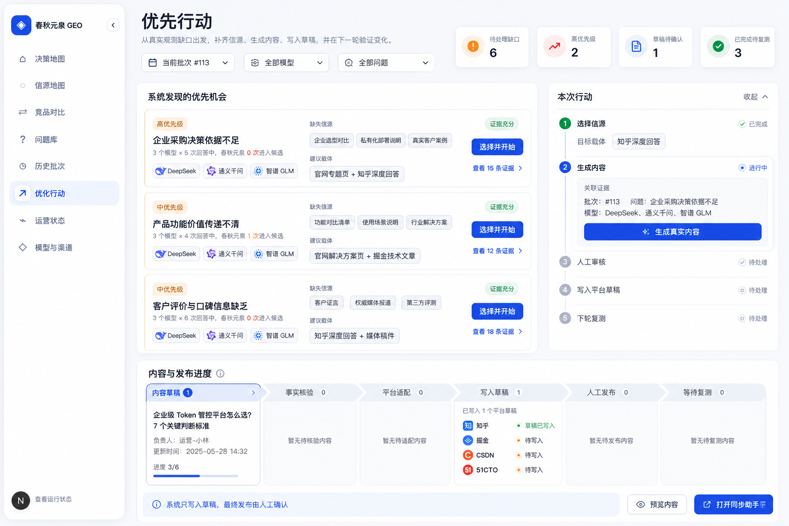

# 春秋元泉 GEO「优先行动」产品与实现设计 v1

> 状态：设计稿，尚未实施  
> 日期：2026-08-06  
> 范围：从真实观测缺口到内容草稿、平台草稿和下一轮复测；最终发布必须人工确认。



## 1. 结论

当前平台已经具备问题、模型、批次、回答原文、引用来源和统一观测台账，但「优化行动」仍是人工填写表单，无法回答三个最重要的问题：

1. 现在最值得解决哪个缺口；
2. 应该补哪一种真实信源；
3. 做完以后有没有在下一批次变好。

v1 应把「优化行动」重构为证据驱动的行动工作台：系统从所选批次的真实回答中发现缺口，给出有证据的信源机会；用户选择一个机会后，系统生成内容简报和真实内容；内容通过事实核验与人工审核后，调用文章同步助手写入各平台草稿；人手动确认发布；系统在后续批次自动关联相同问题并比较变化。

产品闭环只有一条：

```text
真实观测
→ 发现缺口
→ 推荐可补信源
→ 用户选择行动
→ 生成可核验内容
→ 人工审核
→ 写入平台草稿
→ 人工发布
→ 下一批次复测
→ 判断有效 / 无效 / 证据不足
```

## 2. 调研结论与复用边界

### 2.1 成熟产品值得学习的部分

- OtterlyAI 的做法是先从真实引用数据中找出“竞品被引用、自己没有被引用”的缺口，再区分内容创建、第三方页面合作、社区参与和 PR 等不同动作。它也强调先检查可抓取性，再优化内容，并在后续监测中验证变化。[官方行动说明](https://help.otterly.ai/optimize-for-ai-searches) · [官方引用缺口说明](https://help.otterly.ai/onboarding5)
- GEO/AEO Tracker 已把“竞品被引用但品牌未被引用的 URL”建模为 Citation Opportunities，并生成 outreach brief；其 MIT 代码可借鉴机会聚合、历史差值和批次调度，但不应整套并入现有产品。[GitHub](https://github.com/danishashko/geo-aeo-tracker)
- GEOFlow 值得学习知识库、任务、审核和多站点内容出口的分层，但它是另一套完整系统，技术栈和现有主项目差异较大，不适合整仓合并。[GitHub](https://github.com/yaojingang/GEOFlow)
- WechatSync 已支持从浏览器登录态向多个平台写入内容，并默认草稿优先。它应作为发布执行器，而不是重新实现一套平台发布适配器。[GitHub](https://github.com/wechatsync/Wechatsync)

### 2.2 我们真正的差异化

外部产品大多停在“告诉你应该做什么”，春秋元泉可以做到：

- 建议直接来源于国内模型的真实回答、真实引用和重复采样；
- 每条行动能回到具体批次、问题、模型和回答证据；
- 内容生成只使用已确认的品牌事实和引用材料；
- 直接写入国内内容平台草稿，并保留人工发布门禁；
- 下一轮相同问题自动复测并评价行动是否有效。

这才是从监测工具走向 GEO 运营系统的关键。

## 3. 当前产品能力差距

| 优先级 | 缺失能力 | 现在的问题 | v1 目标 |
|---|---|---|---|
| P0 | 行动机会引擎 | 依靠人工看回答、手填行动 | 从批次证据自动生成去重后的机会卡 |
| P0 | 信源目标管理 | 只有引用列表，没有“该补到哪里” | 区分官网、自有账号、可合作第三方和不可控信源 |
| P0 | 内容事实门禁 | AI 可写出未经确认的能力、数字和案例 | 只允许使用品牌事实库和已选证据，未知事实进入人工确认 |
| P0 | 内容资产生命周期 | 行动与文章草稿断开 | 行动、简报、母稿、平台稿、审核、草稿 URL 全链路关联 |
| P0 | 发布执行适配 | 平台与文章同步助手没有产品级状态衔接 | 调用同步助手写草稿，并通过页面回读确认草稿真实存在 |
| P0 | 复测归因 | 做完行动后无法判断是否生效 | 自动关联下一批次相同问题，输出变化与证据强度 |
| P1 | 官网可引用性审计 | 只看模型回答，不能判断自己页面为什么没被引用 | 对目标 URL 做可访问、结构、事实、FAQ、Schema 检查 |
| P1 | 团队协作 | 没有负责人、截止时间、审核人 | 给行动分配负责人和人工门禁，不引入复杂项目管理 |
| P1 | 平台健康 | 不知道同步助手连接、登录和草稿写入是否正常 | 展示平台连接、登录态、最近写入和阻塞原因 |
| P2 | 实验控制 | 容易把随机波动误判为优化效果 | 多批次、重复采样、对照问题和最小样本门槛 |

## 4. “优先行动”应该如何工作

### 4.1 输入范围

用户先选择：

- 当前批次或一个时间范围；
- 一个或多个问题；
- 一个或多个模型；
- 春秋元泉品牌别名和已确认竞品；
- 已确认品牌事实、已有内容资产和可运营平台。

系统不得跨越当前筛选范围悄悄使用历史总数据。历史数据只用于趋势和重复机会去重。

### 4.2 缺口识别

v1 只生成六类可解释机会：

1. **候选缺口**：竞品进入候选/推荐，春秋元泉未进入；
2. **引用缺口**：竞品或同类产品被来源引用，春秋元泉没有引用；
3. **事实缺口**：回答反复需要某项事实，但品牌事实库没有可公开依据；
4. **内容形态缺口**：模型偏好比较表、FAQ、案例、白皮书、数据说明等，而现有内容没有对应载体；
5. **分发缺口**：内容已经存在，但在高频引用平台没有可访问版本；
6. **可抓取性缺口**：目标页面存在，但模型/爬虫无法稳定读取或内容结构不可引用。

每个机会必须包含：

- 证据批次、问题、模型和回答数量；
- 春秋元泉当前表现；
- 竞品/来源的实际表现；
- 缺失信源类型；
- 推荐载体和推荐平台；
- 为什么现在值得做；
- 数据不足、冲突或风险提示。

不满足最小证据门槛时只显示“待积累数据”，不得生成确定性建议。

### 4.3 信源不是平台名称，而是“可被引用的事实载体”

信源目标需要分四类：

| 类型 | 例子 | 产品动作 | 自动化边界 |
|---|---|---|---|
| 自有站点 | 官网专题、帮助中心、FAQ、白皮书、案例页 | 新建或更新真实页面 | 可生成草稿，发布由官网流程确认 |
| 自有平台账号 | 知乎、掘金、CSDN、51CTO、阿里云/腾讯云社区 | 生成平台适配稿并写入草稿 | 可自动写草稿，不自动发布 |
| 可合作第三方 | 行业媒体、已有榜单、合作伙伴文章 | 生成外联 brief、补充材料和建议段落 | 不冒充第三方，不自动改写对方页面 |
| 不可控权威源 | 百科、政府、标准组织、独立媒体 | 仅建议合规的事实建设或 PR 路径 | 不生成伪造背书，不承诺一定收录 |

系统绝不能把“多发几篇品牌软文”包装成补信源。每项内容必须回答真实问题，并清楚标注可验证事实、适用边界和来源。

### 4.4 优先级逻辑

内部计算可采用 0–100 分，但用户界面只显示“高/中/低”和简短原因。

```text
优先级 = 证据强度 25%
       + 问题商业价值 20%
       + 缺口规模 20%
       + 信源复用价值 15%
       + 可执行性 10%
       + 时效性 10%
       - 合规与事实风险惩罚
```

规则：

- 同一问题、信源类型、推荐载体和核心缺口生成稳定指纹，避免每个批次重复建卡；
- 新批次只更新证据、优先级和趋势；
- 推荐必须由确定性统计产生，AI 只负责总结原因、起草 brief 和内容；
- 每个数值都能回到观测台账中的原始回答与引用 URL。

## 5. Image2 界面方案

设计图：[`docs/design/priority-actions-v1-image2.png`](../design/priority-actions-v1-image2.png)

### 5.1 页面信息层级

1. **顶部筛选**：当前批次、模型、问题；
2. **状态摘要**：待处理缺口、高优先级、草稿待确认、完成待复测；
3. **系统发现的优先机会**：只展示有证据、可采取行动的机会卡；
4. **本次行动**：当前所选机会的五步进度和下一步唯一主按钮；
5. **内容与发布进度**：按真实资产状态出现，不做固定空表格。

### 5.2 机会卡

每张卡只回答四件事：

- 我们哪里输了；
- 哪些真实回答证明了这件事；
- 应补什么信源；
- 点击后会开始什么动作。

主动作是“选择并开始”，证据入口是“查看 N 条证据”。不存在证据的卡不能进入正式行动队列。

### 5.3 行动详情

五个阶段：

1. 选择信源；
2. 生成内容；
3. 人工审核；
4. 写入平台草稿；
5. 下轮复测。

每次只突出一个下一步，用户不需要理解底层任务编排。

### 5.4 内容与发布进度

进度区只在已有内容资产或发布任务时出现。状态来源于数据库和插件回读，不使用前端假进度：

```text
内容草稿 → 事实核验 → 平台适配 → 写入草稿 → 人工发布 → 等待复测
```

页面固定提示：“系统只写入草稿，最终发布由人工确认”。

## 6. 数据模型设计

现有 `geo_optimization_actions_v1` 只保存标题、原因、假设、优先级和状态，无法承载完整闭环。建议保留它作为行动主表，并增加以下实体。

### 6.1 行动机会 `geo_action_opportunities_v1`

- `id`, `workspace_id`
- `fingerprint`：用于跨批次去重
- `opportunity_type`
- `title`, `summary`
- `priority_score`, `priority_label`
- `evidence_strength`
- `source_gap_type`, `recommended_asset_type`
- `controllability`, `risk_level`
- `first_seen_batch_id`, `latest_batch_id`
- `status`: detected / selected / dismissed / converted
- `created_at`, `updated_at`

### 6.2 机会证据 `geo_action_opportunity_evidence_v1`

- `opportunity_id`
- `observation_task_id`, `evidence_id`
- `question_plan_id`, `provider_id`, `batch_id`
- `signal_type`, `signal_value`
- `competitor_entity_id`（可空）
- `citation_source_id`（可空）

### 6.3 信源目标 `geo_source_targets_v1`

- `workspace_id`, `name`, `target_type`
- `domain_or_platform`
- `control_mode`: owned / account_controlled / partner / earned
- `existing_url`（可空）
- `cited_answer_count`, `covered_question_count`
- `platform_adapter_key`（可空）
- `status`: available / needs_content / needs_outreach / blocked

### 6.4 内容简报与内容资产

`geo_content_briefs_v1`：

- 关联行动、问题、证据、目标信源；
- 目标受众、回答意图、必须覆盖的事实、禁用表述、结构、引用清单、平台要求；
- brief 生成版本和人工确认状态。

`geo_content_assets_v1`：

- 母稿和版本；
- 内容类型、标题、正文、摘要、图片 manifest；
- 事实核验结果、来源 URL、内容指纹；
- status: generating / draft / needs_review / approved / superseded。

`geo_platform_variants_v1`：

- `content_asset_id`, `platform_key`
- 平台标题、正文、摘要、标签、分类、图片清单；
- 内容指纹和审核状态。

### 6.5 发布任务与复测

`geo_distribution_runs_v1`：一次将一个已审核内容资产写入若干平台草稿。

`geo_distribution_targets_v1`：

- platform、adapter_version、login_state；
- mcp_request_status、draft_url、draft_readback_status；
- `draft_saved_at`, `human_publish_status`, `public_url`；
- `waiting_human` / `blocked` / `submission_uncertain` 原因；
- 页面回读证据和截图路径。

`geo_action_retests_v1`：

- 关联原行动、原批次、新批次；
- 相同问题与模型的前后样本；
- mention / candidate / recommendation / citation 的变化；
- conclusion: improved / unchanged / regressed / insufficient_evidence；
- 结论必须保留样本数和置信度。

## 7. 后端服务与接口

### 7.1 机会生成

```http
POST /api/v1/workspaces/{id}/action-opportunities/discover
GET  /api/v1/workspaces/{id}/action-opportunities
GET  /api/v1/workspaces/{id}/action-opportunities/{opportunity_id}
POST /api/v1/workspaces/{id}/action-opportunities/{opportunity_id}/select
POST /api/v1/workspaces/{id}/action-opportunities/{opportunity_id}/dismiss
```

`discover` 必须是后台任务，输入明确的批次、问题和模型范围。结果保存到数据库，页面通过真实任务状态显示进度。

### 7.2 内容生产

```http
POST /api/v1/workspaces/{id}/actions/{action_id}/briefs
POST /api/v1/workspaces/{id}/briefs/{brief_id}/generate-content
PATCH /api/v1/workspaces/{id}/content-assets/{asset_id}/review
POST /api/v1/workspaces/{id}/content-assets/{asset_id}/variants
```

生成请求必须传入 `brand_fact_ids` 和 `evidence_ids`。模型输出中的每个产品事实都需要匹配事实库或进入 `needs_review`。

### 7.3 写入平台草稿

```http
POST /api/v1/workspaces/{id}/content-assets/{asset_id}/distribution-runs
GET  /api/v1/workspaces/{id}/distribution-runs/{run_id}
POST /api/v1/workspaces/{id}/distribution-runs/{run_id}/retry-target
POST /api/v1/workspaces/{id}/distribution-targets/{target_id}/confirm-human-publish
```

执行顺序：

1. 检查内容已审核；
2. 读取文章同步助手支持平台和登录状态；
3. 每个平台使用独立适配稿调用 `sync_article`；
4. 请求被接受只记录 `mcp_request_accepted`；
5. EgoLite 回读真实草稿页，确认标题、正文、图片和保存状态；
6. 通过后记录 `draft_saved`；
7. 用户在真实平台页面手动发布；
8. 系统回读公开、审核中或不确定状态。

### 7.4 下一轮复测

行动完成后可选择：

- 立即建立一次复测批次；
- 加入下一次常规批次；
- 等待 7/30 天后复测。

复测必须使用原问题、原模型集合和相同重复次数；模型版本、时间和来源变化单独记录，避免伪造因果关系。

## 8. 状态机

```text
detected
→ selected
→ brief_ready
→ content_generating
→ content_needs_review
→ content_approved
→ platform_adapting
→ sync_requested
→ draft_saved
→ waiting_human_publish
→ submitted_pending_review / public_live
→ waiting_retest
→ improved / unchanged / regressed / insufficient_evidence
```

任何阶段都允许进入 `blocked` 或 `waiting_human`。`submission_uncertain` 不是成功，不能自动重试最终发布。

## 9. AI 的职责与确定性规则的职责

确定性程序负责：

- 统计样本、模型、问题、品牌状态和引用 URL；
- 找出竞品被引用而品牌未被引用的来源；
- 机会去重、优先级基础分和状态机；
- 内容事实匹配、链接和证据完整性；
- 发布状态、草稿回读和前后批次指标。

AI 负责：

- 把证据总结成用户能读懂的机会说明；
- 在限定事实和来源内生成内容 brief；
- 生成母稿和各平台表达版本；
- 总结复测差异，但不能替代统计结论。

## 10. 风险与产品门禁

- 不因模型一次回答就生成高优先级行动；
- 不伪造第三方信源、客户案例、数据、排名或媒体背书；
- 不把品牌词堆砌当作 GEO 优化；
- 不自动点击最终发布；
- 不把 MCP 请求成功当作草稿保存成功；
- 不把短期随机波动表述成行动带来的确定因果；
- 不在界面暴露算法版本、数据库字段、内部状态枚举和调试信息。

## 11. 分阶段实施建议

### Phase 1：机会与选择

- 从统一观测台账生成真实机会；
- 机会卡、证据抽屉、信源目标选择；
- 机会转行动和跨批次去重。

验收：每张卡可回到真实回答，删除/改变筛选后统计同步变化。

### Phase 2：真实内容

- 品牌事实库门禁；
- 内容 brief、母稿、事实核验和人工审核；
- 生成官网/知乎/技术社区不同载体。

验收：不存在无来源数字和能力；表格、引用、图片和链接在预览中正确渲染。

### Phase 3：同步助手草稿

- 接文章同步助手 MCP；
- 平台登录与连接状态；
- 独立平台稿写入、真实草稿回读、错误恢复。

验收：至少知乎、掘金、CSDN、51CTO 四个平台能写入真实草稿；最终发布保持人工动作。

### Phase 4：复测闭环

- 从行动创建标准化复测批次；
- 前后批次按同一问题/模型/重复次数比较；
- 输出有效、无变化、退步或证据不足。

验收：结论可回到原始回答、批次和草稿/公开 URL，不用人工拼接数据。

## 12. v1 验收场景

以“企业级 Token 管控平台怎么选？”为例：

1. 选择批次 #113、DeepSeek/通义千问/智谱 GLM；
2. 系统从 15 条真实回答发现“春秋元泉未进入候选，回答偏好企业选型对比与私有化部署依据”；
3. 用户选择“知乎深度回答”作为受控信源；
4. 系统生成 brief，并只引用已确认事实和真实来源；
5. 人工审核通过后生成知乎、掘金、CSDN、51CTO 适配稿；
6. 点击“写入所选平台草稿”，四个平台显示各自真实状态和草稿 URL；
7. 用户手动打开并发布；
8. 下一批次复测相同问题，系统比较候选进入率、推荐率、引用率和来源变化；
9. 行动卡最终显示“有效 / 无变化 / 退步 / 证据不足”及对应证据。

这条链路全部跑通，才算“优先行动”成为产品能力，而不是建议表单。

